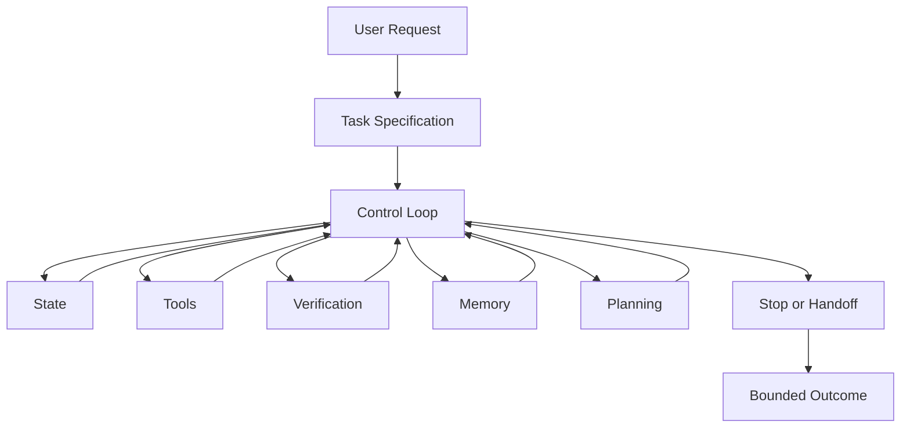
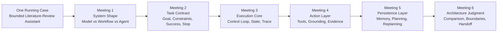
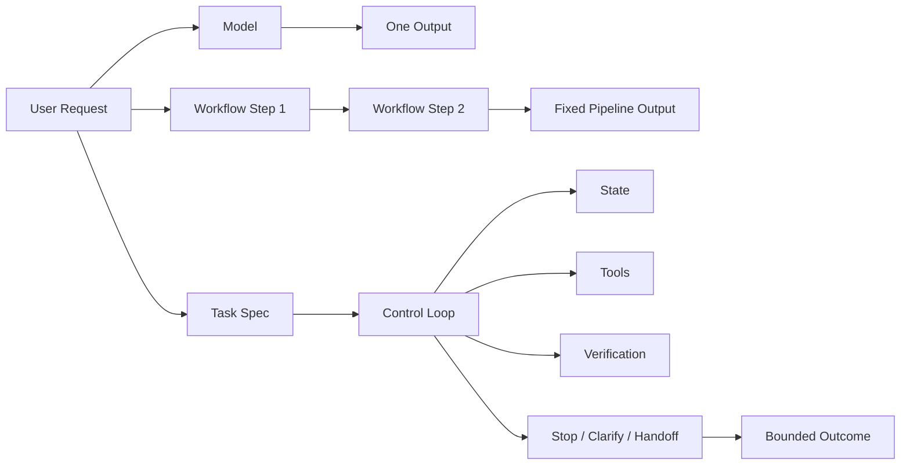
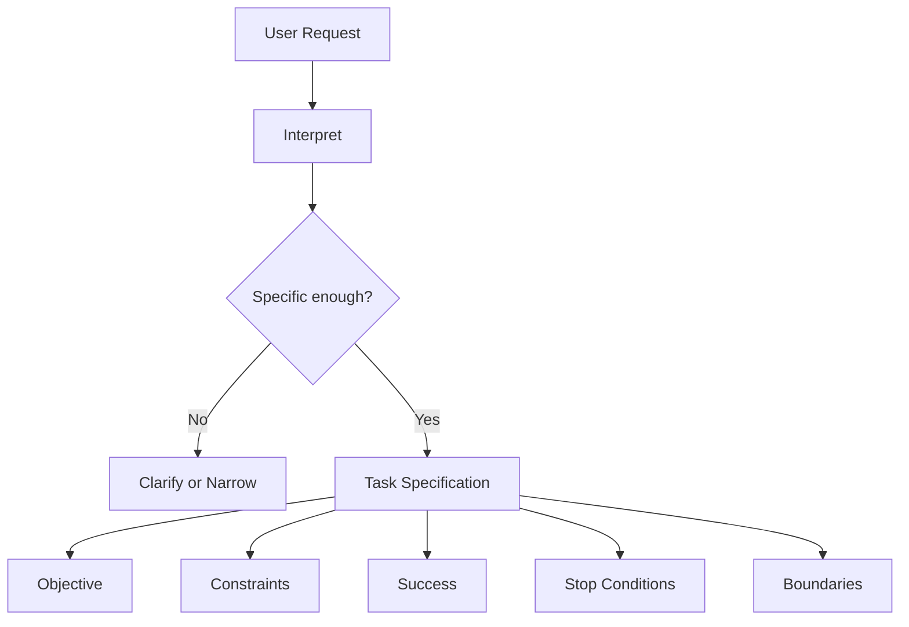
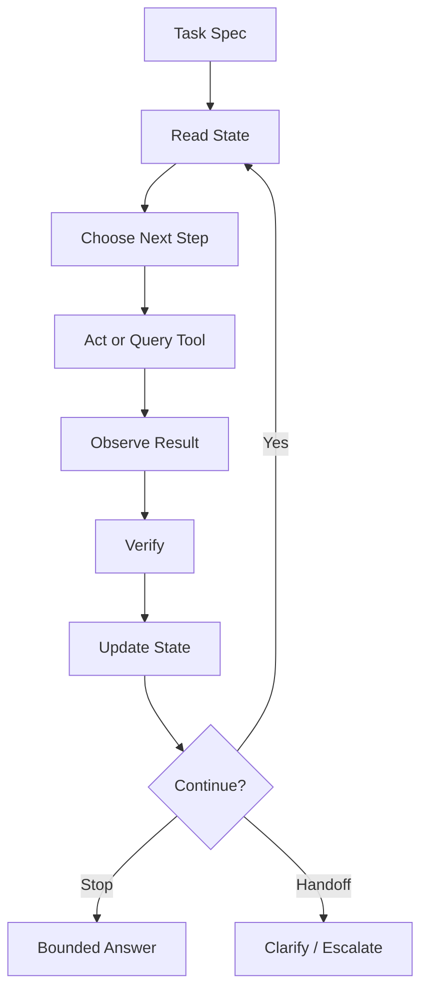
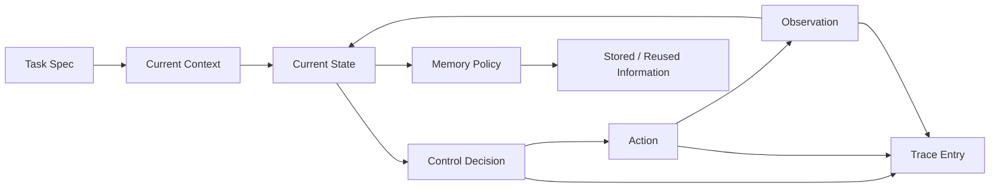
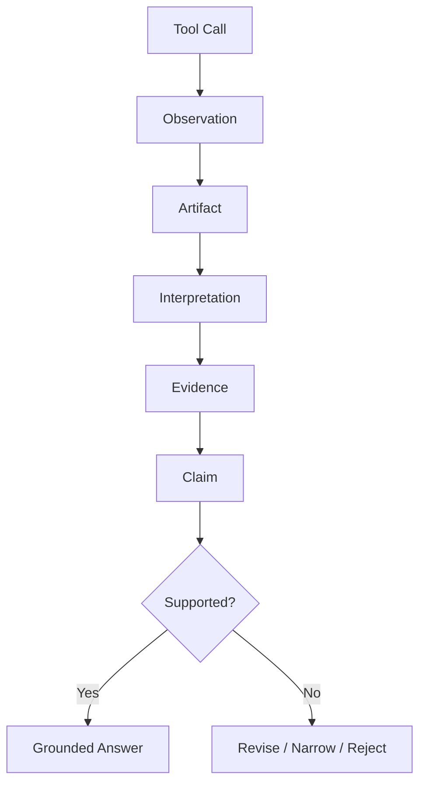
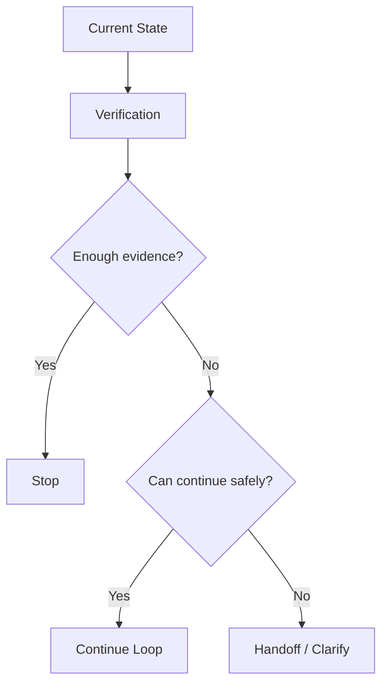
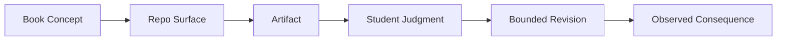

# Lesson 0: Conceptual Map

This document gathers the conceptual material for `Lesson 0` in one place.

## Course Instance

Complete these local fields for the specific run of the course.

Communication:

- `Teams space or channel:`

Schedule:

- `meeting dates and times:`
- `room or remote-link information:`

Submission and grading:

- `student repo invite or setup instruction:`
- `assignment deadlines:`
- `grading weights if used locally:`
- recommended submission structure:

```text
student-coursework/
  assignment_01/
    submission.md
  assignment_02/
    submission.md
  assignment_03/
    submission.md
  assignment_04/
    submission.md
  assignment_05/
    submission.md
  assignment_06/
    submission.md
```

Recommended default meeting mode:

- `Lesson 0`, `Meeting 1`, and `Meeting 2` can work remotely,
- `Meeting 3-6` are usually better on site.

## Intro: Opening Topics

### Teaching Notes

Calibration questions:

- who uses chatbots regularly,
- who has used a coding assistant,
- who has used GitHub before,
- which term is least clear right now.

`Lesson 0` stays broad.
Memory, planning, and verification appear later in the course.

### Live Opening: 0-5 min

- brief introduction,
- `Teams` communication,
- which meetings can be remote and which are better on site,
- the short calibration questions.

## 1. The Main Question Of The Course

The course revolves around one precise question:

> How does a generative model become a bounded, goal-directed agentic system through architecture?

Many discussions of AI systems blur together three very different things:

- a model,
- a fixed workflow around a model,
- a genuinely goal-directed system that can react to what it observes.

The course is therefore not mainly about:

- broad AI trends,
- vendor tooling,
- prompt tricks,
- deployment,
- reinforcement learning,
- building a large application from scratch.

It is about the structure of bounded agentic systems:

- goals,
- task representation,
- control loops,
- state,
- memory,
- planning,
- tools,
- verification,
- stopping,
- handoff,
- architecture comparison.

### Architecture diagram



These components form the structural vocabulary used throughout the course.

## 2. Why One Running Case Is Used

The whole course uses one recurring case:

- an offline literature-review assistant.

Using one stable task isolates the architectural differences across meetings.

### Example running case

Imagine the user says:

> “Prepare a bounded literature review on tool-using language agents using only the local course corpus. Focus on recent survey-style papers, give a short synthesis, and stop if the corpus is too weak.”

This one request can be realized through different system shapes:

- a model-only answer,
- a fixed workflow,
- a bounded agentic loop.

The course is about understanding the difference between those shapes.

### Architecture diagram



## 3. Model, Workflow, And Agent

### 3.1 Model

A model produces an output from an input.

Example:

- the user asks for a literature review,
- the model produces a paragraph immediately.

What the model does not do by itself:

- define success conditions,
- maintain explicit state,
- decide when to stop,
- check grounding,
- clarify ambiguity.

In other words, a model can generate.
It does not by itself define a bounded system.

### 3.2 Workflow

A workflow adds fixed structure around the model.

Example:

1. collect three documents,
2. summarize each,
3. combine the summaries,
4. output the result.

This is more structured than a single model call, but the sequence is fixed.
The system does not genuinely decide what to do next based on observations in a goal-directed loop.

### 3.3 Agent

An agentic system adds bounded control.

That means:

- it has an explicit task,
- it can observe intermediate results,
- it can choose among next steps,
- it can carry forward state,
- it can stop, clarify, or hand off.

The distinction is:

- tool use alone does not make a system agentic,
- multiple steps alone do not make a system agentic,
- bounded goal-directed control is what separates the agentic case from the other two.

### Comparative example

For the same literature-review request:

- `Model`: immediately writes an answer.
- `Workflow`: always runs the same preset summarization pipeline.
- `Agent`: decides whether the task is specific enough, whether evidence is sufficient, whether it should search more, stop, or ask for clarification.

### Architecture diagram



## 4. Request Versus Task

Students often think the user request is already the task.
This course teaches that it is not.

### Request

A request is what the user says.
It may be vague, underspecified, or internally ambiguous.

Example:

> “Give me a review of agent papers.”

That is not yet a bounded system task.

### Task

A task is a bounded execution contract.
In this course, a task usually includes:

- objective,
- constraints,
- success conditions,
- stopping conditions,
- scope boundaries.

### Example transformation

Request:

> “Give me a review of agent papers.”

Bounded task:

- objective: summarize the local corpus on tool-using language agents,
- constraints: use only the local corpus,
- success: return 3-5 themes and cite specific documents,
- stop: stop if fewer than two relevant sources are found,
- boundary: do not answer using outside knowledge.

The whole agentic loop depends on task quality.

### Architecture diagram



## 5. Control Loop

Once a task exists, the course asks: how does the system unfold over time?

The answer is the control loop.

At a high level, the loop does things like:

- inspect the current state,
- decide the next step,
- use a tool or perform a reasoning step,
- verify what happened,
- update state,
- decide whether to continue, stop, or hand off.

### Example

For the literature-review assistant:

1. inspect current task and known sources,
2. choose to search the local corpus,
3. inspect retrieved summaries,
4. verify whether evidence is sufficient,
5. either continue gathering or produce a bounded synthesis,
6. stop if the task is satisfied or hand off if evidence is too weak.

### What the loop makes visible

A final answer alone hides the structure.
A loop makes the structure visible:

- what the system knew,
- what it decided,
- what it saw,
- when it should have stopped.

### Architecture diagram



## 6. State, Context, Memory, And Trace

This part is conceptually central and often confusing.

### 6.1 Context

Context is what is currently in view for the next step.
It is the immediate working information available to the system.

Example:

- current task spec,
- the last tool observation,
- the current draft answer.

### 6.2 State

State is the current structured situation of the run.
It includes what the system currently knows or tracks across steps.

Example:

- retrieved candidate sources,
- current blockers,
- whether clarification is needed,
- whether a partial summary already exists.

### 6.3 Memory

Memory is not generic storage.
In this course, memory means representation plus policy.

That means:

- what is stored,
- why it is stored,
- when it is reused,
- when it should be ignored or refreshed.

Example:

- storing a prior source ranking,
- reusing that ranking only if it is still relevant,
- not trusting stale memory blindly.

### 6.4 Trace

A trace is the recorded sequence of what the system did.
It is not the same as state.

A trace answers:

- what step happened,
- in what order,
- based on what observation.

The distinction is:

- state is the current situation,
- trace is the historical record.

Students need this distinction because later they will inspect traces and ask:

- where did the run first go wrong,
- what was the earliest decisive evidence,
- what did the system know at that moment.

### Mini example

- `state`: “currently two relevant papers found, one blocker active.”
- `trace`: “step 1 searched corpus, step 2 ranked results, step 3 found evidence weak, step 4 continued anyway.”

### Architecture diagram



## 7. Tool Use, Grounding, Artifact, And Evidence

This course treats tools seriously.
Tool use is not decorative.

### Tool use

A tool is a way for the system to access or act on something outside the immediate model output.

In the course repo, tools are bounded and deterministic.

Example:

- looking up a local paper record,
- reading a local source summary,
- comparing variants from a local artifact set.

### Grounding

Grounding means the system’s claim is tied to actual observations or source artifacts.

Example of a grounded claim:

- “This corpus strongly emphasizes tool use and verification because two cited survey documents explicitly discuss those themes.”

Example of an ungrounded claim:

- “Recent research agrees that planning is always the most important part.”

The second claim may sound plausible, but unless it is tied to course evidence, it is not grounded.

### Artifact

An artifact is any inspectable object produced or used by the course package.

Examples:

- `task_spec.json`,
- `trace.jsonl`,
- `tool_observations.jsonl`,
- `comparison_matrix.md`,
- `stop_decision.json`.

### Evidence

Evidence is what an artifact supports when interpreted carefully.

A central distinction in the course is:

- artifact = the object,
- evidence = what that object justifies.

### Architecture diagram



## 8. Verification

Verification is the bridge between action and trustworthy continuation.

It asks:

- did the last step actually support the task,
- is the claim grounded,
- should the system continue,
- should it revise,
- should it stop or hand off.

Example:

- the system retrieves two documents,
- but verification finds that one is only weakly relevant,
- so the system should narrow its claim or search again.

Without verification, the system may continue confidently on weak evidence.
The course wants students to see that verification is not “extra polish.”
It affects control.

## 9. Planning

Planning is not simply “thinking harder.”
It is explicit task structuring.

Example:

- first identify relevant papers,
- then cluster them into themes,
- then produce the final synthesis.

Planning becomes useful when:

- tasks are multi-step,
- order matters,
- intermediate structure helps later decisions.

But the course also emphasizes that planning is not automatically good.
A plan is useful only if it fits the task and is updated when needed.

## 10. Stop And Handoff

Bounded systems need explicit endings.

### Stop

Stop means:

- the system has done enough for the current task,
- the result is bounded and acceptable,
- continuing would not improve the task meaningfully.

### Handoff

Handoff means:

- the system should not continue autonomously,
- clarification or escalation is needed,
- the boundary of autonomous action has been reached.

### Example

For the literature-review assistant:

- `stop`: enough local sources were found and synthesized clearly,
- `handoff`: the user’s scope is too vague or the local corpus is too weak.

The course treats stopping and handoff as part of correctness.
An agent that never knows when to stop is not well-bounded.

### Architecture diagram



## 11. Architecture Comparison

By the end of the course, students should be able to compare architectures rather than just describe them.

Architecture comparison asks questions like:

- which system shape fits this task,
- what boundaries does it respect,
- what failures is it prone to,
- what artifacts make those failures visible.

Example comparison:

- a fixed workflow may be simpler and safer for a well-bounded task,
- an agentic loop may be better when intermediate observations should change next steps,
- a memory-rich design may help if the task requires structured persistence,
- but it may also add risk if stale memory is reused carelessly.

The course ends with comparison and bounded judgment rather than feature building.

## 12. Why The Repo And Book Work Together

The book gives the conceptual map.
The repo gives inspectable implementation and artifacts.

The intended learning loop is:

1. read a concept,
2. inspect the repo or artifact surface,
3. connect the concept to an observable system behavior,
4. later make a small bounded intervention and observe what changed.

This is the course’s teaching philosophy in practice.

### Architecture diagram



## 13. What Students Must Do Before `Meeting 1`

Before `Meeting 1`:

1. go through [STUDENT_SETUP.md](/home/przemek/Biznes/Kursy/course-generation/understanding/runs/Agentic-GenAI-Systems/final_package/STUDENT_SETUP.md),
2. read [book.pdf](/home/przemek/Biznes/Kursy/course-generation/understanding/runs/Agentic-GenAI-Systems/final_package/book/book.pdf), Chapter 1, pages 7-15.
