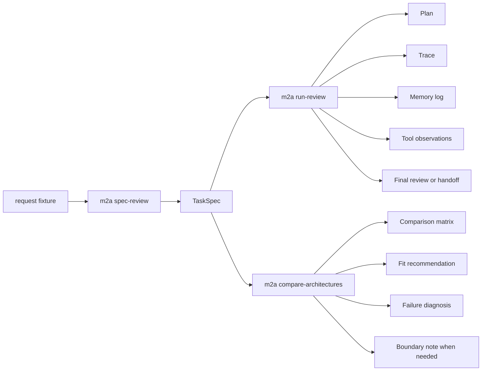

# model-to-agent-checkpoint

`model-to-agent-checkpoint` is one cumulative, offline teaching repository for a single bounded application: a deterministic literature-review assistant. Its point is not model quality. Its point is architectural literacy.

The repository makes one question concrete:

> How does a context-bounded generative model become a bounded, goal-directed agentic system through architecture?

It answers that question by running the same literature-review task through five variants over the same local corpus, the same task-spec schema, and the same artifact format:

- `model_only`
- `scripted_pipeline`
- `tool_rich_memoryless`
- `memory_rich_tool_poor`
- `capstone_agent`

The active capstone slice is **AA-S09 — Architecture comparison, synthesis, and boundaries**. Earlier slices are not separate projects. They are embodied here as the lower-level modules, fixtures, tests, and artifacts that the comparison layer reuses.

## Why the repository is shaped this way

The code is deliberately small, but the boundaries are real:

- goals are structured objects, not prompt prose
- context, external state, memory, observations, and world-facing outcomes are separate
- tool calls are causal inputs to later decisions
- verification can block success and force handoff
- architecture recommendations are grounded in observed run outcomes, not slogans

That is the production-close part. The trimmed part is equally intentional:

- no live web or APIs
- no framework-specific orchestration
- no databases or async systems
- no RL control, IR internals, symbolic planning solvers, or deployment stack

## How to read this repository

Use this label scheme while studying the code and artifacts:

- `Production-close habit` means a design move you should expect to transfer to stronger real systems.
- `Teaching simplification` means the repository intentionally chose a smaller bounded version of a broader real-world concern.
- `Do transfer` means keep the principle.
- `Do not overgeneralize` means do not mistake this exact implementation detail for the only correct production shape.

Examples:

- `Production-close habit`: explicit task specs, explicit state ownership, verification that can block success, and architecture comparison grounded in observed runs.
- `Teaching simplification`: deterministic model simulation, synthetic local corpus, lexical search, and artifact-based clarification instead of interactive user turns.

## Quickstart

```bash
poetry install

poetry run m2a spec-review data/requests/clear_bounded_review.txt --out-dir scratch/spec-clear

poetry run m2a run-review scratch/spec-clear/task_spec.json \
  --variant capstone_agent \
  --out-dir scratch/run-capstone

poetry run m2a compare-architectures scratch/spec-clear/task_spec.json \
  --out-dir scratch/compare-clear

poetry run pytest
```

The repository ships ready-to-read reference artifacts under `examples/` if you want the outputs before running anything.

If you cannot or do not want to use `poetry install` immediately, the runtime commands also work directly with the local source tree:

```bash
PYTHONPATH=src python3.13 -m m2a.cli spec-review data/requests/clear_bounded_review.txt --out-dir /tmp/spec-clear
PYTHONPATH=src python3.13 -m m2a.cli run-review data/expected_task_specs/clear_bounded_review.json --variant capstone_agent --out-dir /tmp/run-capstone
PYTHONPATH=src python3.13 -m m2a.cli compare-architectures data/expected_task_specs/clear_bounded_review.json --out-dir /tmp/compare-clear
```

That fallback is useful in constrained or offline environments because the runtime itself uses only the standard library.

## Main workflows

### 1) Formalize a request into a task spec

```bash
poetry run m2a spec-review data/requests/clear_bounded_review.txt
```

This emits `task_spec.json` and `task_spec.md` with explicit goals, constraints, success criteria, stop rules, ambiguity flags, and handoff conditions.

Reference artifact: `examples/spec_review/clear_bounded_review/`

### 2) Run one architecture variant

```bash
poetry run m2a run-review data/expected_task_specs/clear_bounded_review.json \
  --variant capstone_agent
```

This emits `plan.json`, `trace.jsonl`, `state_snapshots.jsonl`, `memory_log.jsonl`, `tool_observations.jsonl`, `verification.jsonl`, `stop_decision.json`, plus either `final_review.md` or `handoff_note.md`.

Reference artifacts:

- success with memory-policy checking: `examples/run_review/capstone_stale_memory_harms/`
- bounded clarification outcome: `examples/run_review/capstone_ambiguous_request/`

### 3) Compare architectures on the same task

```bash
poetry run m2a compare-architectures data/expected_task_specs/clear_bounded_review.json
```

This runs multiple variants on the same task and emits:

- `comparison_matrix.md`
- `fit_recommendation.md`
- `failure_diagnosis.md`
- `boundary_note.md` when relevant

Reference artifacts:

- capstone recommendation on an in-scope review: `examples/compare_architectures/clear_bounded_review/`
- explicit out-of-scope boundary handling: `examples/compare_architectures/boundary_handoff/`

## Concept map



## Repository layout

- `src/m2a/` — package code
- `data/` — local corpus, request fixtures, expected task specs, memory seeds, toy planning fixture
- `tests/` — unit and end-to-end regression tests
- `docs/` — architecture notes, bridge refresher, slice docs, capability coverage, boundaries
- `examples/` — committed reference outputs for the three primary workflows

`docs/architecture.md` gives the concrete module graph and state ownership map.

## Dependencies

The runtime is Python 3.11 plus the standard library. The only non-stdlib dependency is `pytest`, used only to keep scenario and regression tests concise.

## What AA-S09 adds

The earlier slices establish the pieces: structured goals, state, memory, tools, planning, verification, and stop or handoff. AA-S09 adds the synthesis layer:

- run multiple variants on one bounded task
- explain the memory-rich/tool-poor vs tool-rich/memoryless tradeoff explicitly
- classify failures structurally
- recommend an architecture from observed outcomes
- emit a boundary note instead of drifting into deferred topics

## Verification steps

After `poetry install`, these commands should work without network access:

```bash
poetry run pytest

poetry run m2a spec-review data/requests/ambiguous_request.txt --out-dir scratch/spec-ambiguous
poetry run m2a run-review scratch/spec-ambiguous/task_spec.json --variant capstone_agent --out-dir scratch/run-ambiguous
poetry run m2a compare-architectures data/expected_task_specs/boundary_handoff.json --out-dir scratch/compare-boundary
```

## Boundaries

This repository names adjacent fields but does not absorb them. When a request depends on RL-based control, IR internals, symbolic planning formalisms, live retrieval, or production operations, the correct outcome is a boundary note or handoff, not a fake answer.

See `docs/deferred-topics-and-boundaries.md` for the explicit boundary contract.

## Transfer guide

- `Do transfer`: represent goals explicitly enough to steer control flow, verification, and stopping.
- `Do transfer`: keep context, external state, memory, observations, and final outcomes separate enough to inspect independently.
- `Do transfer`: let verification and failure diagnosis change what the system does next.
- `Do transfer`: compare architectures on the same task with shared artifact shapes.
- `Do not overgeneralize`: the offline synthetic corpus is a teaching device, not a claim that real systems should avoid richer data layers.
- `Do not overgeneralize`: the deterministic model simulator is there to expose control semantics, not to model modern LM behavior faithfully.
