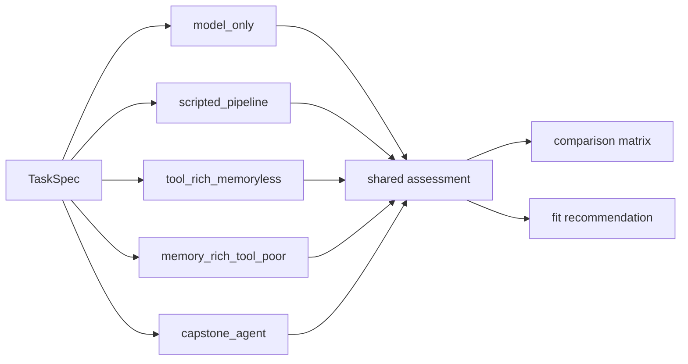

# Architecture variants

All variants share the same task-spec schema, corpus, tool contracts, and artifact format. The point is not to compare different apps. The point is to compare different architectures on the same bounded task.

## Variant table

| Variant | Loop shape | Tools | Memory | Verification effect | Typical outcome |
| --- | --- | --- | --- | --- | --- |
| `model_only` | direct generation with final check | none | none | only blocks success after the fact | fluent but under-grounded |
| `scripted_pipeline` | fixed straight-line pipeline | search, read, cite | none | checks once; no corrective branch | good on simple, well-shaped tasks |
| `tool_rich_memoryless` | bounded loop | search, read, cite | no durable memory | can see blockers, but synthesis forgets earlier evidence | good at freshness, weak at retention |
| `memory_rich_tool_poor` | bounded loop | read, note, cite | durable memory, including stale note risk | memory can help or hurt | good continuity, weak recovery from missing evidence |
| `capstone_agent` | bounded plan-memory-act-verify-stop loop | search, read, note, cite | durable memory with stricter stale handling | can change downstream behavior and stop safely | best default for multi-constraint review tasks |

## Why the tradeoff pair matters

The repository makes one canonical question explicit:

> On this bounded review task, is it better to be tool-rich but memoryless, or memory-rich but tool-poor?

The answer depends on what actually bottlenecks the task.

- If the task needs fresh exploration, search matters.
- If the task needs multi-step synthesis, retention matters.
- If the task needs both, the capstone agent usually wins because it combines search with evidence-linked memory and bounded stopping.

## Where the differences live in code

- `model_only` and `scripted_pipeline` live in `src/m2a/baselines.py`
- the tradeoff pair and capstone agent are parameterized in `src/m2a/control.py`
- memory behavior lives in `src/m2a/memory.py`
- tool behavior lives in `src/m2a/tools.py`
- stop logic lives in `src/m2a/feedback.py` and `src/m2a/control.py`

## Reference cases

| Case | What it shows |
| --- | --- |
| `examples/compare_architectures/clear_bounded_review/` | capstone recommendation for an in-scope multi-topic task |
| `data/requests/over_planning_overhead.txt` | scripted pipeline can be the right choice on a smaller task |
| `examples/run_review/capstone_stale_memory_harms/` | stricter memory policy prevents stale recall from passing silently |
| `examples/compare_architectures/boundary_handoff/` | the correct answer can be “none in scope” |

## Variant comparison flow

