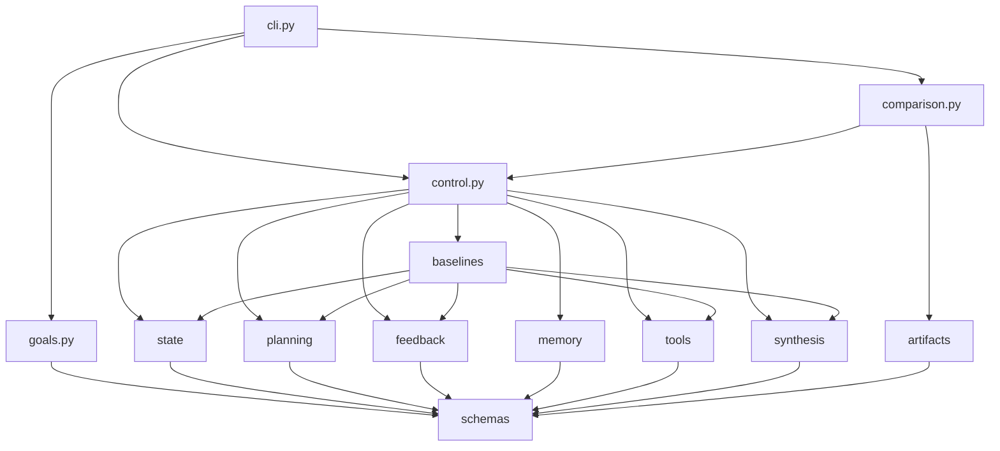

# Architecture

The repository has one package, one CLI root, one canonical task schema, and multiple thin architecture variants. The comparison layer is additive over the same shared primitives rather than a separate app.

## Directory shape

```text
model-to-agent-checkpoint/
├── src/m2a/
│   ├── cli.py
│   ├── goals.py
│   ├── control.py
│   ├── baselines.py
│   ├── comparison.py
│   ├── planning.py
│   ├── feedback.py
│   ├── memory.py
│   ├── tools.py
│   ├── state.py
│   ├── synthesis.py
│   ├── artifacts.py
│   └── schemas.py
├── data/
├── examples/
├── tests/
└── docs/
```

## Dependency direction



The intent is simple local reasoning:

- CLI parses input and chooses a service path.
- services (`goals`, `control`, `comparison`) orchestrate work
- supporting modules (`planning`, `feedback`, `memory`, `tools`, `state`, `synthesis`) provide bounded domain behavior
- `schemas` defines the stable shared shapes
- `artifacts` is the text-file boundary

## Main module responsibilities

| Module | Responsibility | Why it exists |
| --- | --- | --- |
| `schemas.py` | Canonical data models for task specs, traces, memory events, observations, stop decisions, and comparisons. | Keeps every variant comparable through one shared shape. |
| `goals.py` | Rewrites a raw request into a bounded `TaskSpec`. | Makes goals, constraints, ambiguity, and handoff explicit before any run. |
| `state.py` | Owns active context, external run state, trace events, and snapshots. | Makes context vs state inspectable rather than implicit. |
| `memory.py` | Stores memory content plus retrieval and forgetting policy. | Teaches memory as representation plus policy. |
| `tools.py` | Defines local corpus tools and their contracts. | Makes tool semantics and side effects explicit. |
| `planning.py` | Builds plans, selects evidence sets, and encodes light replanning logic. | Keeps planning visible and testable. |
| `feedback.py` | Verifies progress, turns blockers into control signals, and labels failures structurally. | Ensures critique can change behavior. |
| `synthesis.py` | Drafts the final literature review from evidence. | Keeps review drafting separate from control flow. |
| `baselines.py` | Implements `model_only` and `scripted_pipeline`. | Makes non-agentic and minimally agentic behavior explicit. |
| `control.py` | Runs the configurable loop used by the tradeoff pair and the capstone agent. | Shows how architecture changes come from control structure and policy. |
| `comparison.py` | Runs multi-variant comparisons and emits matrix/recommendation/boundary artifacts. | Implements AA-S09 directly. |
| `artifacts.py` | Reads and writes text-first artifacts. | Keeps I/O narrow and inspectable. |
| `cli.py` | Wires commands to application code. | Keeps entrypoints thin. |

## State ownership

This repository treats “where information lives” as part of the curriculum.

| State kind | Owner | What it contains | Where it is visible |
| --- | --- | --- | --- |
| Task specification | `TaskSpec` | goals, constraints, budgets, stop rules, ambiguity, boundaries | `task_spec.json`, `task_spec.md` |
| Active context | `RunState.active_context` | current action, current focus, recent observation refs, recent memory refs | `state_snapshots.jsonl` |
| External run state | `RunState.external_state` | selected papers, read papers, note paths, citations, review metadata | `state_snapshots.jsonl`, `run_summary.json` |
| Memory | `MemoryStore` | seed memories, note memories, retrievals, forgetting events, policy snapshot | `memory_log.jsonl` |
| Tool observations | `ToolObservation` | tool inputs, outputs, summaries, side effects | `tool_observations.jsonl` |
| Verification | `VerificationResult` | checks, blockers, evidence refs | `verification.jsonl`, `trace.jsonl` |
| World-facing outcome | `StopDecision` + review or handoff note | success or bounded non-success outcome | `stop_decision.json`, `final_review.md`, `handoff_note.md` |

## Why there is no extra infrastructure

There is no async layer, database, or framework wrapper because none of those are needed to teach the architectural question at hand. Adding them would mostly teach deployment and orchestration products by accident.

## Production-close vs teaching-trimmed

| Concern | Production-close habit to learn | Teaching simplification in this repository | How to read it |
| --- | --- | --- | --- |
| goal handling | Turn a request into an explicit task contract before execution | The contract is derived from deterministic request parsing rather than an actual LM or interactive planner | `Do transfer` the explicit contract, `do not overgeneralize` the parsing mechanism |
| state ownership | Keep active context, durable run state, memory, observations, and outcomes distinct | The state is stored in simple in-memory structures and JSONL artifacts | `Do transfer` the separation, `do not overgeneralize` the storage substrate |
| tools and environment | Define tool contracts and use observations causally in later decisions | The environment is a fixed local corpus with four deterministic tools | `Do transfer` the contract boundary, `do not overgeneralize` the toy environment |
| verification and stop logic | Let verification block success and trigger replanning, clarification, or handoff | Verification uses a small rule-based checker rather than richer evaluators or human review | `Do transfer` the control semantics, `do not overgeneralize` the checker implementation |
| architecture comparison | Compare variants on one shared task with shared artifact shapes | The comparison stays inside one bounded offline domain | `Do transfer` the fair comparison method, `do not overgeneralize` the domain scope |
| infrastructure | Keep boundaries explicit and traceable | The repo omits async orchestration, services, queues, databases, and deployment concerns | `Do transfer` the clarity of seams, `do not overgeneralize` the absence of infrastructure |

## Practical reading order

For most readers, the shortest correct path is:

1. `README.md`
2. `docs/bridge-refresh.md`
3. `src/m2a/goals.py`
4. `src/m2a/control.py`
5. `src/m2a/comparison.py`
6. one committed example under `examples/compare_architectures/clear_bounded_review/`
7. the slice docs in order from `AA-S01` to `AA-S09`
