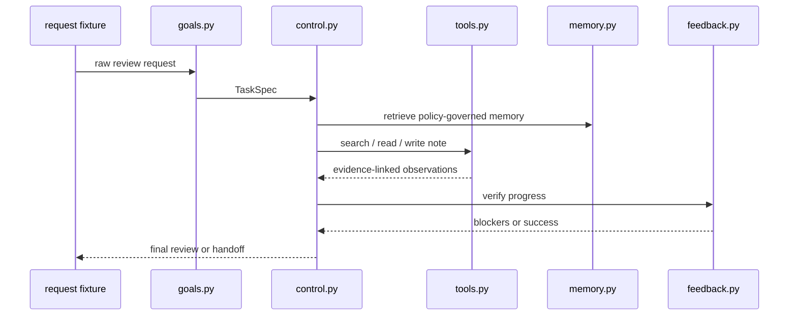

# Bridge refresh: AA-S03 through AA-S08 on one case

AA-S09 is a synthesis slice. It assumes the learner already has the lower pieces in view. This document is the shortest refresher path back through AA-S03 to AA-S08 using one canonical request:

`data/requests/clear_bounded_review.txt`

The goal is not to re-teach every slice. The goal is to restore the working mental model needed for architecture comparison.

## The refresher path

### 1. Rebuild the request as a task object

Run:

```bash
poetry run m2a spec-review data/requests/clear_bounded_review.txt --out-dir scratch/bridge-spec
```

Look at:

- `scratch/bridge-spec/task_spec.json`
- `examples/spec_review/clear_bounded_review/task_spec.json`

What to notice:

- goals are explicit lists
- stop and handoff conditions are first-class
- the request is bounded before any tool call happens

### 2. Watch context and state separate

Open the capstone trace from the comparison example:

- `examples/compare_architectures/clear_bounded_review/variants/capstone_agent/trace.jsonl`
- `examples/compare_architectures/clear_bounded_review/variants/capstone_agent/state_snapshots.jsonl`

What to notice:

- trace shows *what happened*
- state snapshots show *where information now lives*
- active context is not the same thing as external run state

### 3. Revisit memory as policy, not just storage

Open:

- `examples/compare_architectures/clear_bounded_review/variants/capstone_agent/memory_log.jsonl`
- `examples/run_review/capstone_stale_memory_harms/memory_log.jsonl`

What to notice:

- the first memory event is a policy snapshot
- writes and retrievals are logged separately
- stale memory can become a blocker, not just background data

### 4. Revisit tools as contracts

Open:

- `src/m2a/tools.py`
- `examples/compare_architectures/clear_bounded_review/variants/capstone_agent/tool_observations.jsonl`

What to notice:

- each tool has preconditions, outputs, and side effects
- search and read are not interchangeable
- citation assembly is an action, not a string-formatting afterthought

### 5. Revisit planning and verification

Open:

- `src/m2a/planning.py`
- `src/m2a/feedback.py`
- `data/planning/greedy_trap.json`
- `tests/test_planning.py`

What to notice:

- planning is a selection policy, not mystical intelligence
- verification labels missing coverage explicitly
- replanning is triggered by blockers, not by generic “thinking harder”

### 6. Revisit stop, clarification, and handoff

Open:

- `examples/run_review/capstone_ambiguous_request/handoff_note.md`
- `examples/compare_architectures/boundary_handoff/boundary_note.md`
- `src/m2a/control.py`

What to notice:

- bounded non-success outcomes are part of correctness
- ambiguity and out-of-scope drift are handled explicitly
- the run never claims normal success while blockers remain

## Refresher diagram



## Why this refresher matters for AA-S09

Architecture comparison is only meaningful if the lower pieces are visible. Otherwise “compare variants” collapses into vibe-based opinions about agents.

AA-S09 asks: given those lower pieces, which architecture fits this bounded review task, and why?
