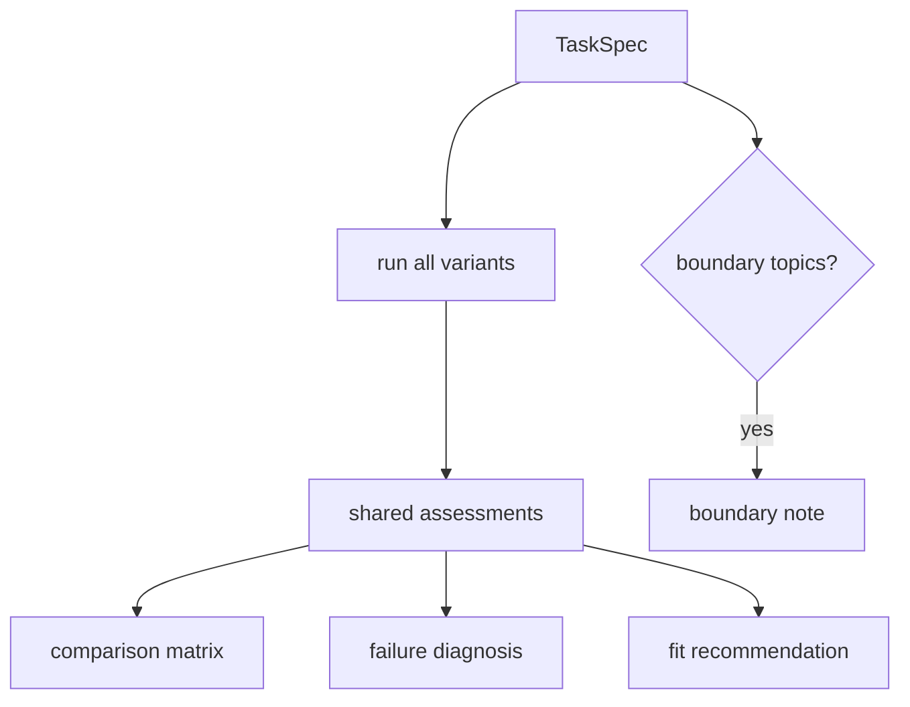

# Capstone synthesis guide

AA-S09 turns the earlier slices into one defended architecture recommendation workflow.

## What changes at the capstone layer

Earlier slices teach the pieces. The capstone layer asks the stronger question:

> Given a concrete bounded task, which architecture actually fits, and where are the boundaries?

In this repository, that is implemented by `src/m2a/comparison.py` on top of the same shared schemas, tools, memory logic, planning helpers, and feedback rules used by the single-variant runs.

## The capstone workflow

1. formalize the request with `m2a spec-review`
2. run multiple variants with `m2a compare-architectures`
3. inspect the per-variant traces
4. read the matrix, failure diagnosis, and fit recommendation
5. check whether a boundary note is required

## What “fit” means here

The recommendation is not a general ranking of architectures. It is task-bounded.

For this repository, fit is judged by observed outcomes such as:

- successful completion vs bounded handoff
- citations used
- papers read
- memory events
- tool profile actually exercised
- blocking issues that remained at stop time

That keeps the recommendation grounded in evidence.

## The clear case

For `clear_bounded_review`, the repository recommends `capstone_agent`.

Why:

- it succeeds
- it uses both search and note-backed memory
- it keeps the same bounded artifact format as the simpler variants
- it is a better default for a multi-topic comparative review than either tradeoff extreme

## The small-task counterexample

For `over_planning_overhead`, the repository recommends `scripted_pipeline`.

That case is intentionally small. It teaches the opposite of “agents are always better”: sometimes the smaller architecture is the right one.

## The out-of-scope counterexample

For `boundary_handoff`, the repository recommends `none_in_scope`.

That teaches a final capstone lesson: architecture comparison is still bounded by domain scope.

## Capstone diagram

