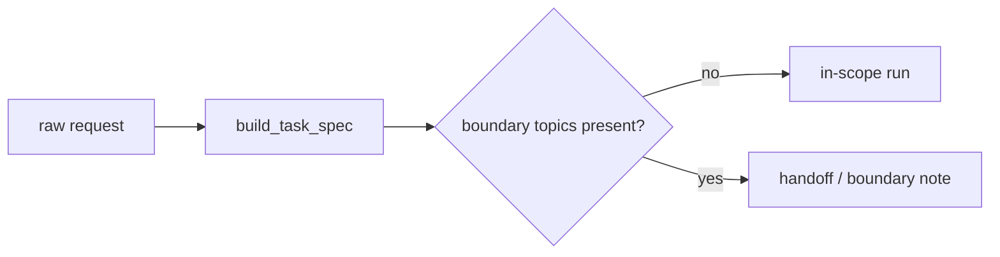

# Deferred topics and boundaries

This repository is intentionally architectural and compositional. It does not quietly absorb adjacent specialties.

## Explicitly deferred topics

- RL-based control or policy learning
- IR internals such as ranking/index design
- formal symbolic planning languages or solvers
- live web retrieval and external APIs
- framework-specific orchestration products
- deployment, observability, governance, and production operations
- multimodal grounding
- heavy benchmark methodology

## Why they are deferred

Those topics are important, but they are not prerequisites for understanding how a bounded model becomes an agentic system through state, memory, planning, tools, verification, and stop/handoff logic.

Adding them here would distort the repository’s teaching target.

## How the boundary is enforced

`src/m2a/goals.py` detects explicit boundary topics during task formalization.

If a request depends on deferred topics, the system does **not**:

- fake a grounded review
- pretend the local corpus covers the missing scope
- silently widen the architecture

Instead it emits:

- a `handoff_note.md` from `run-review`, or
- a `boundary_note.md` from `compare-architectures`

## Example

See:

- `data/requests/boundary_handoff.txt`
- `examples/compare_architectures/boundary_handoff/boundary_note.md`

That example asks for live retrieval benchmarks, vector-ranking internals, and a production deployment architecture. The correct result is a boundary note, not a speculative answer.

## Boundary flow

## What the repository *does* still teach

Even when it stops at the boundary, it still teaches something important: bounded systems need explicit non-goals.

That is part of architecture quality, not an omission.
