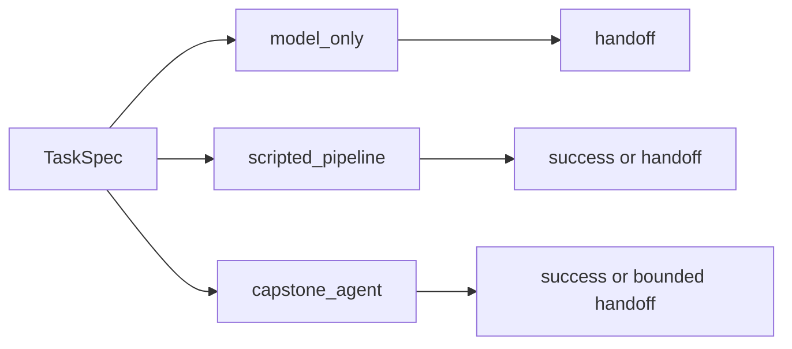

# AA-S01 — Model-only, scripted, and looped distinctions

## Slice goal

Make the difference between direct generation, fixed scripting, and bounded agent loops visible on the same literature-review task.

## Why this slice matters

Without this slice, the later agent architecture discussion collapses into naming tricks. The learner needs to see that agency is architectural control structure, not just tool access or prompt length.

## Prerequisites

Repository overview and the running literature-review case.

## Steel thread / running-case scenario

Run `model_only`, `scripted_pipeline`, and `capstone_agent` on `clear_bounded_review` and compare their traces and stop decisions.

## Code grounding

- `src/m2a/baselines.py::run_model_only`
- `src/m2a/baselines.py::run_scripted_pipeline`
- `src/m2a/control.py::run_variant`

## Workflow grounding

`poetry run m2a compare-architectures data/expected_task_specs/clear_bounded_review.json`

## Artifact grounding

`examples/compare_architectures/clear_bounded_review/`

## Diagram

## Misconception or failure mode surfaced

“An agent is just a chatbot with a better prompt.” The committed comparison shows different control paths, not just different wording.

## Deferred notes / boundaries

This slice still stays offline and deterministic. It does not claim anything about deployment or provider integration.
