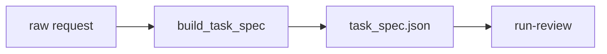

# AA-S02 — Structured goal specification

## Slice goal

Turn raw review requests into explicit task contracts before any run begins.

## Why this slice matters

Goals matter only when they shape control flow, evaluation, and stopping. Hidden prompt prose would make later comparisons meaningless.

## Prerequisites

AA-S01.

## Steel thread / running-case scenario

Use `spec-review` on `clear_bounded_review.txt` and `ambiguous_request.txt` to see both a clear spec and a clarification-ready spec.

## Code grounding

- `src/m2a/goals.py::build_task_spec`
- `src/m2a/artifacts.py::emit_task_spec`

## Workflow grounding

`poetry run m2a spec-review data/requests/ambiguous_request.txt --out-dir scratch/spec-ambiguous`

## Artifact grounding

`examples/spec_review/clear_bounded_review/task_spec.json` and `examples/run_review/capstone_ambiguous_request/handoff_note.md`

## Diagram

## Misconception or failure mode surfaced

“A request is already a goal spec.” The ambiguous fixture shows why that is false.

## Deferred notes / boundaries

The repository does not implement interactive chat clarification loops; clarification is represented as an artifact.
