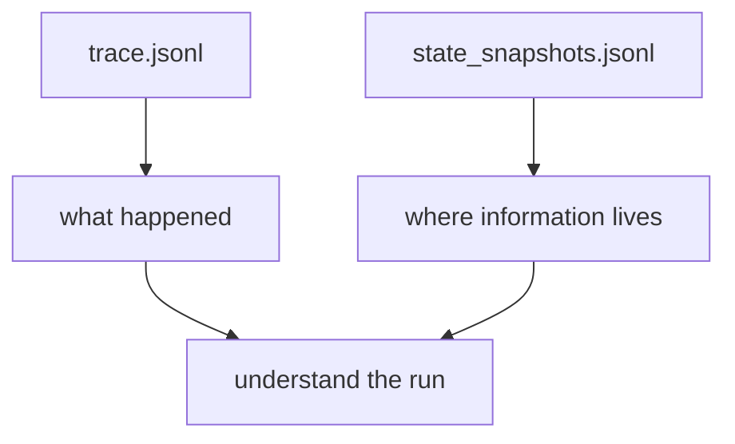

# AA-S03 — State, context, and execution traces

## Slice goal

Expose where information lives during a multi-step run.

## Why this slice matters

Learners need more than a narrative of steps. They need a map of state ownership.

## Prerequisites

AA-S01 and AA-S02.

## Steel thread / running-case scenario

Read the capstone trace and state snapshots for `clear_bounded_review` side by side.

## Code grounding

- `src/m2a/state.py::RunState`
- `src/m2a/control.py::_run_profile`

## Workflow grounding

`poetry run m2a run-review data/expected_task_specs/clear_bounded_review.json --variant capstone_agent`

## Artifact grounding

`examples/compare_architectures/clear_bounded_review/variants/capstone_agent/trace.jsonl` and `state_snapshots.jsonl`

## Diagram

## Misconception or failure mode surfaced

“A long trace is enough.” The state snapshots show what the trace alone cannot: active context vs external state.

## Deferred notes / boundaries

There is no distributed state or database-backed run history here. The point is conceptual clarity.
