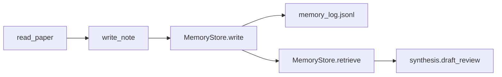

# AA-S04 — Memory types, persistence roles, and policies

## Slice goal

Teach memory as content plus policy rather than as a generic storage bucket.

## Why this slice matters

The capstone slice explicitly compares memory-rich and memoryless systems, so memory policy has to be concrete.

## Prerequisites

AA-S03.

## Steel thread / running-case scenario

Compare `memory_rich_tool_poor` with `capstone_agent` on `stale_memory_harms`.

## Code grounding

- `src/m2a/memory.py::MemoryStore`
- `src/m2a/memory.py::MemoryPolicy`
- `src/m2a/control.py::_memory_policy_for`

## Workflow grounding

`poetry run m2a run-review data/requests/stale_memory_harms.txt --variant capstone_agent`

## Artifact grounding

`examples/run_review/capstone_stale_memory_harms/memory_log.jsonl`

## Diagram

## Misconception or failure mode surfaced

“More memory is always better.” The stale-memory case shows why policy matters.

## Deferred notes / boundaries

There is no learned memory retrieval or user-modeling layer.
