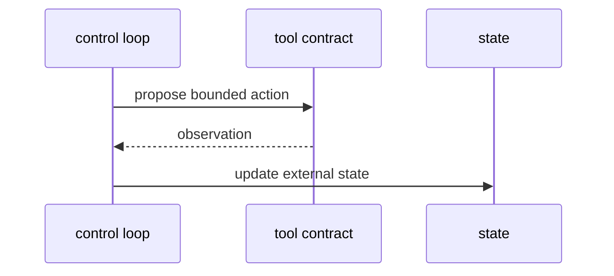

# AA-S05 — Action selection and tool interfaces

## Slice goal

Make tool use concrete as a set of bounded actions with explicit contracts.

## Why this slice matters

Tool use matters only when the interface semantics are visible and downstream behavior actually depends on the observations.

## Prerequisites

AA-S02 through AA-S04.

## Steel thread / running-case scenario

Inspect a capstone run and trace how `search_corpus`, `read_paper`, `write_note`, and `assemble_citations` change the state.

## Code grounding

- `src/m2a/tools.py::ToolBox`
- `src/m2a/control.py::_propose_next_action`
- `src/m2a/control.py::_run_profile`

## Workflow grounding

`poetry run m2a run-review data/expected_task_specs/clear_bounded_review.json --variant capstone_agent`

## Artifact grounding

`examples/compare_architectures/clear_bounded_review/variants/capstone_agent/tool_observations.jsonl`

## Diagram

## Misconception or failure mode surfaced

“Any tool call makes the system agentic.” The scripted pipeline uses tools too, but without the same control semantics.

## Deferred notes / boundaries

There is no live external integration or mutable environment beyond note files.
