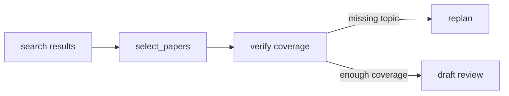

# AA-S06 — Planning, decomposition, and replanning

## Slice goal

Show planning as a selective control choice that shapes evidence collection.

## Why this slice matters

Planning is one of the main ways a generator becomes a bounded agent, but the repository keeps it small and inspectable.

## Prerequisites

AA-S03 through AA-S05.

## Steel thread / running-case scenario

Read `data/planning/greedy_trap.json` and the corresponding tests, then compare it to how the capstone plan is serialized.

## Code grounding

- `src/m2a/planning.py::build_initial_plan`
- `src/m2a/planning.py::select_papers`
- `src/m2a/planning.py::replan`

## Workflow grounding

`poetry run m2a compare-architectures data/expected_task_specs/clear_bounded_review.json`

## Artifact grounding

`data/planning/greedy_trap.json`, `tests/test_planning.py`, and emitted `plan.json` files

## Diagram

## Misconception or failure mode surfaced

“Planning is always better.” The small-task fixture can still prefer the scripted pipeline.

## Deferred notes / boundaries

Formal symbolic planners are intentionally out of scope.
