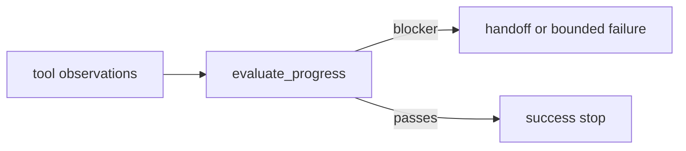

# AA-S07 — Reflection, verification, and grounding

## Slice goal

Tie reflection to evidence and explicit failure signals.

## Why this slice matters

Without this slice, reflection becomes empty self-critique. The repository’s rule is stricter: feedback must be able to change behavior or block success.

## Prerequisites

AA-S03 through AA-S06.

## Steel thread / running-case scenario

Compare the successful capstone stale-memory run with the memory-rich/tool-poor failure on the same request.

## Code grounding

- `src/m2a/feedback.py::evaluate_progress`
- `src/m2a/feedback.py::reflection_actions`
- `src/m2a/control.py::_finalize_result`

## Workflow grounding

`poetry run m2a run-review data/requests/stale_memory_harms.txt --variant memory_rich_tool_poor`

## Artifact grounding

`examples/run_review/capstone_stale_memory_harms/verification.jsonl` and the matching comparison diagnosis

## Diagram

## Misconception or failure mode surfaced

“Reflection automatically improves correctness.” The code requires blockers before reflective action is emitted.

## Deferred notes / boundaries

The repository does not implement learned critique models or benchmark-heavy evaluators.
