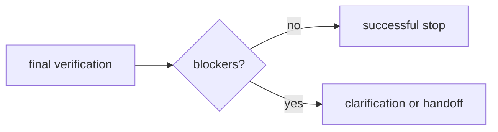

# AA-S08 — Stopping, clarification, handoff, and bounded autonomy

## Slice goal

Represent correct non-success outcomes as first-class behavior.

## Why this slice matters

A bounded system is not complete until it knows when not to continue.

## Prerequisites

AA-S02 through AA-S07.

## Steel thread / running-case scenario

Run `capstone_agent` on `ambiguous_request.txt` and `boundary_handoff.txt`.

## Code grounding

- `src/m2a/control.py::_make_handoff`
- `src/m2a/control.py::_stop_decision`
- `src/m2a/feedback.py::evaluate_progress`

## Workflow grounding

`poetry run m2a run-review data/requests/ambiguous_request.txt --variant capstone_agent`

## Artifact grounding

`examples/run_review/capstone_ambiguous_request/handoff_note.md` and `examples/compare_architectures/boundary_handoff/boundary_note.md`

## Diagram

## Misconception or failure mode surfaced

“Stopping and handoff are production-only concerns.” The repository treats them as correctness conditions.

## Deferred notes / boundaries

There is no human review queue or ticketing layer; the bounded outcome is a text artifact.
