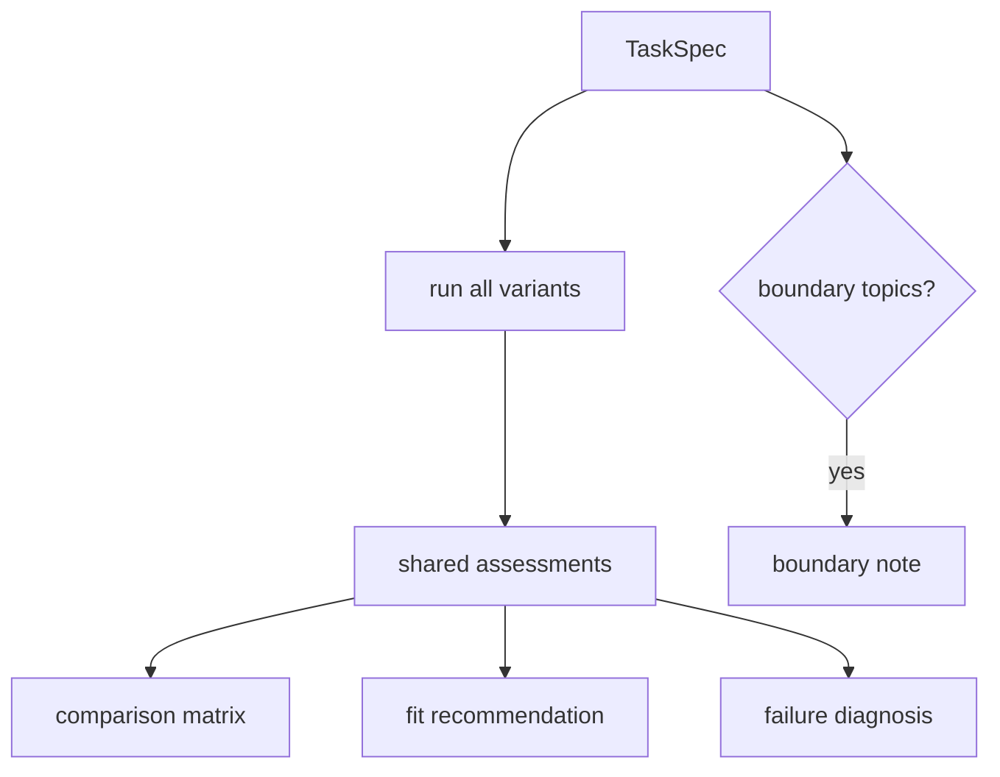

# AA-S09 — Architecture comparison, synthesis, and boundaries

## Slice goal

Compare multiple variants on one bounded task, diagnose their failures structurally, and recommend one architecture or boundary outcome.

## Why this slice matters

This is the capstone slice. It turns the earlier pieces into a defended architecture judgment rather than a collection of parts.

## Prerequisites

AA-S01 through AA-S08.

## Steel thread / running-case scenario

Run `compare-architectures` on `clear_bounded_review` and `boundary_handoff`.

## Code grounding

- `src/m2a/comparison.py::compare_architectures`
- `src/m2a/comparison.py::_assess`
- `src/m2a/comparison.py::_render_recommendation`

## Workflow grounding

`poetry run m2a compare-architectures data/expected_task_specs/clear_bounded_review.json --out-dir scratch/compare-clear`

## Artifact grounding

`examples/compare_architectures/clear_bounded_review/` and `examples/compare_architectures/boundary_handoff/`

## Diagram

## Misconception or failure mode surfaced

“One architecture is best in general.” The repository recommends different variants on different bounded tasks and can also recommend `none_in_scope`.

## What transfers vs what is trimmed

- `Do transfer`: compare architectures on the same task, with the same task spec and artifact shape, before making a recommendation.
- `Do transfer`: let observed run outcomes outrank architectural slogans.
- `Do transfer`: treat boundary notes and bounded non-success outcomes as valid architectural results.
- `Do not overgeneralize`: the exact scoring signals and bounded literature-review task are teaching scaffolds, not a universal architecture selection formula.

## Deferred notes / boundaries

The repository stops at architectural/compositional synthesis. It does not move into production operations or specialized subfields.
