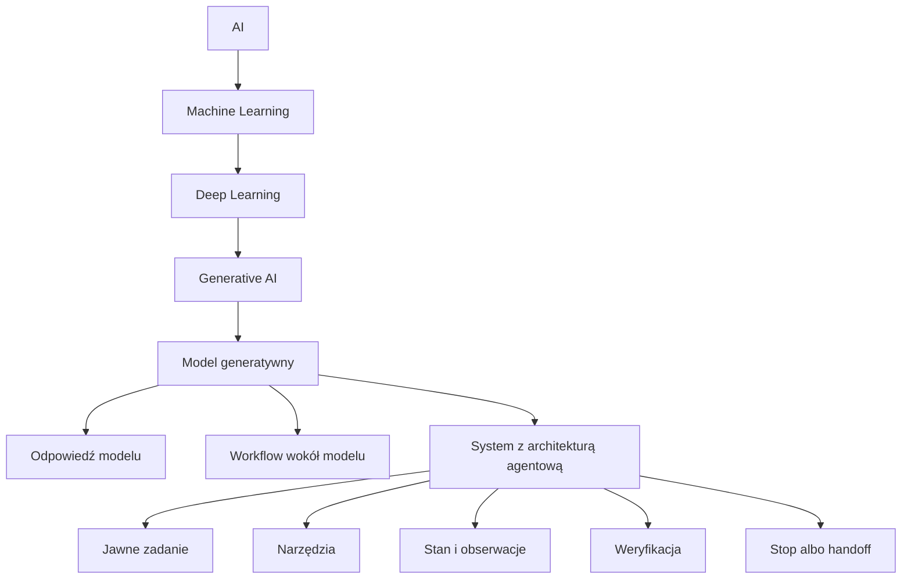
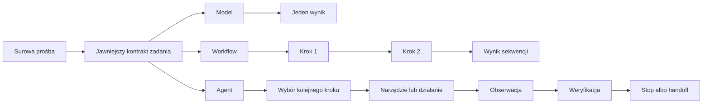
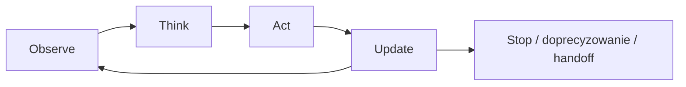

# Wstęp do AI

## 1. Organizacja kursu

- komunikacja odbywa się przez `Teams`,
- kurs ma formę hybrydową,
- kurs obejmuje 6 zadań opartych głównie na raportach,
- podstawowe materiały stanowią książka i repo,
- korzystanie z AI jest dozwolone, ale uzasadnienie i dowody mają większe znaczenie niż stylistyczna płynność tekstu.

### Stałe założenia robocze

- korzystanie z AI jest dozwolone bez narzuconych limitów ilościowych; ograniczeniem nie jest samo użycie narzędzia, lecz jakość uzasadnienia, obserwacji i dowodów,
- rekomendowane jest używanie coding agentów do przeglądu repozytorium, porównywania opcji, przygotowywania zmian i sprawdzania hipotez, ale nie zastępuje to odpowiedzialności za dobór dowodów, ograniczenie zakresu i końcowy osąd,
- podstawowym językiem pracy w części kodowej kursu jest `Python`,
- kursowe repo opiera się na `Python 3.11` i bibliotece standardowej,
- poza `pytest`, używanym do uruchamiania testów, nie zakłada się dodatkowych zależności zewnętrznych ani dodatkowych bibliotek.

### Pytania kalibracyjne

- kto regularnie używa chatbotów,
- kto używał coding assistanta albo coding agenta,
- kto pracował z GitHubem albo analizował `diff`, to znaczy zapis zmian w plikach,
- kto spotkał się z systemem opisywanym jako „agent”, mimo że nie było jasne, na czym polega jego sterowanie.

## 2. Krótka mapa pojęć: AI, ML, DL, GenAI i systemy agentowe

Ponieważ część studentów może nie mieć wcześniejszego przygotowania z AI, warto uporządkować podstawowe pojęcia od najbardziej ogólnego do najbardziej konkretnego.

### AI

`AI` to najszersza kategoria. Obejmuje systemy, które wykonują zadania kojarzone zwykle z inteligencją, takie jak rozpoznawanie wzorców, podejmowanie decyzji, generowanie tekstu albo sterowanie działaniem.

### ML

`Machine Learning` jest podzbiorem AI. Oznacza podejście, w którym system uczy się wzorców z danych zamiast opierać się wyłącznie na ręcznie zapisanych regułach.

### DL

`Deep Learning` jest podzbiorem Machine Learning. Obejmuje modele oparte na sieciach neuronowych uczonych na dużych zbiorach danych. Współczesne modele językowe są właśnie częścią tej warstwy.

### GenAI

`Generative AI` to ta część współczesnego AI, która generuje nową treść:

- tekst,
- obraz,
- dźwięk,
- kod.

Model generatywny potrafi wytworzyć odpowiedź, ale sam w sobie nie rozstrzyga jeszcze:

- jaki dokładnie jest cel zadania,
- jak używać narzędzi,
- co zapamiętać między krokami,
- kiedy wynik jest dostatecznie uzasadniony,
- kiedy należy się zatrzymać.

Na potrzeby tego kursu `narzędzie` oznacza po prostu kontrolowany sposób uzyskania informacji albo wykonania ograniczonego działania poza samą odpowiedzią modelu.

### System agentowy

System agentowy nie jest po prostu „silniejszym modelem”. Jest to architektura zbudowana wokół modelu lub modeli, która dodaje:

- jawne zadanie,
- logikę wyboru kolejnych kroków,
- pracę na obserwacjach,
- użycie narzędzi,
- weryfikację,
- decyzje typu `stop` albo `handoff`.

Najprościej można to ująć tak:

- `AI` jest najszerszym polem,
- `ML` jest jednym z głównych podejść w AI,
- `DL` jest ważną częścią ML,
- `GenAI` jest obszarem skupionym na generowaniu treści,
- `systemy agentowe` są warstwą architektoniczną, która może wykorzystywać model generatywny, ale nie sprowadza się do samego modelu.

### Schemat zależności



### Jak umieścić znane narzędzia na tej mapie

W praktyce studenci znają zwykle nie abstrakcyjne warstwy, lecz konkretne produkty i interfejsy. Dlatego warto umieścić je na tej mapie w sposób uproszczony:

- chatbot albo `ChatGPT` to aplikacja zbudowana wokół modelu generatywnego,
- coding assistant to narzędzie wykorzystujące model generatywny do pracy z kodem,
- coding agent to system, który oprócz modelu korzysta także z narzędzi, obserwacji, stanu roboczego oraz decyzji o kolejnym kroku,
- nie każdy coding assistant jest coding agentem i nie każdy system używający narzędzi jest systemem agentowym.

## 3. Cztery przykłady tego samego typu systemu

W tym kursie nie chodzi o „agenta do wszystkiego”. Chodzi o ograniczony system, który:

- dostaje prośbę,
- zamienia ją na bardziej jawny kontrakt zadania,
- wykonuje kolejne kroki,
- obserwuje wynik tych kroków,
- zatrzymuje się albo robi handoff, gdy powinien.

Najłatwiej zobaczyć to na czterech przykładach: dwóch z programowania i dwóch z przeglądu literatury.

### Przykład A: poprawienie niedziałającego testu

Surowa prośba:

> „Napraw niedziałający test w tym repozytorium, nie zmieniając niepowiązanych plików.”

Żeby system mógł działać sensownie, musi z tej prośby wydobyć bardziej jawny kontrakt:

- cel: doprowadzić do przejścia wskazanego testu,
- ograniczenie: zmienić tylko pliki związane z problemem,
- sukces: odpowiednia weryfikacja przechodzi,
- stop: zatrzymać się albo zapytać, jeśli źródło błędu albo zakres są niejasne.

To samo zadanie może zostać zrealizowane przez trzy różne kształty systemu:

- `Model`: od razu proponuje patch albo wyjaśnienie.
- `Workflow`: zawsze wykonuje tę samą sekwencję, na przykład inspect -> edit -> test.
- `Agent`: decyduje, które pliki obejrzeć, czy ma już dość dowodów, czy trzeba uruchomić kolejny test i czy należy się zatrzymać albo zrobić handoff.

### Przykład B: zmiana jest zbyt szeroka albo niejednoznaczna

Surowa prośba:

> „Zrefaktoruj cały moduł autoryzacji i przy okazji popraw UX logowania.”

Tutaj poprawny kontrakt zadania musi od razu uwzględniać granice:

- cel: odpowiedzieć tylko w takim zakresie, który da się jasno uzasadnić i bezpiecznie zweryfikować,
- ograniczenie: nie robić szerokiej przebudowy bez doprecyzowania zakresu,
- sukces: wykonać ograniczoną zmianę albo jasno pokazać, dlaczego potrzeba decyzji człowieka,
- stop albo handoff: zatrzymać się, jeśli wymaganie miesza kilka różnych celów albo ryzyko zmiany jest zbyt duże.

Znów można zobaczyć trzy różne kształty systemu:

- `Model`: może wygenerować przekonujący plan albo duży patch mimo niejasnego zakresu.
- `Workflow`: może mechanicznie przejść przez ustaloną sekwencję kroków, chociaż zadanie powinno najpierw zostać zawężone.
- `Agent`: może rozpoznać, że wymaganie jest zbyt szerokie albo niejednoznaczne, i zakończyć działanie wynikiem `stop` albo `handoff`.

### Przykład C: ograniczony przegląd artkułów naukowych

Surowa prośba:

> „Na podstawie lokalnego korpusu wskaż 3 artkuły naukowe o agentach używających narzędzi i napisz krótką syntezę głównych wątków.”

Żeby system mógł działać sensownie, musi z tej prośby wydobyć coś bardziej konkretnego:

- cel: znaleźć do trzech odpowiednich artkułów naukowych,
- ograniczenie: używać tylko lokalnego korpusu,
- sukces: zwrócić krótką syntezę z przypisanymi źródłami,
- stop: zatrzymać się albo zapytać, jeśli korpus jest zbyt słaby.

To samo zadanie może zostać zrealizowane przez trzy różne kształty systemu:

- `Model`: od razu generuje odpowiedź.
- `Workflow`: zawsze wykonuje tę samą sekwencję, na przykład search -> read -> summarize -> combine.
- `Agent`: sprawdza, czy materiał jest wystarczający, czy trzeba szukać dalej, i czy należy się zatrzymać albo poprosić o doprecyzowanie.

### Przykład D: korpus jest za słaby

Surowa prośba:

> „Przygotuj przekrojowy przegląd najnowszych trendów w agentic AI na podstawie lokalnego korpusu.”

Tutaj poprawny kontrakt zadania musi od razu uwzględniać granice:

- cel: odpowiedzieć tylko w takim zakresie, jaki pozwala uzasadnić lokalny korpus,
- ograniczenie: nie wychodzić poza lokalne źródła,
- sukces: odpowiedzieć tylko wtedy, gdy materiał jest wystarczający,
- stop albo handoff: zatrzymać się, jeśli zakres jest zbyt szeroki albo dowody są zbyt słabe.

Znów można zobaczyć trzy różne kształty systemu:

- `Model`: może wygenerować atrakcyjnie brzmiącą odpowiedź mimo słabego pokrycia w korpusie.
- `Workflow`: może kontynuować ustaloną sekwencję mimo tego, że powinien się zatrzymać.
- `Agent`: może rozpoznać, że materiał jest za słaby, i zakończyć działanie wynikiem `stop` albo `handoff`.

### Wspólny punkt

We wszystkich przykładach:

- surowa prośba nie jest jeszcze zadaniem,
- samo użycie narzędzi nie czyni systemu agentowym,
- sama wielokrokowość nie czyni systemu agentowym,
- kluczowe jest ograniczone sterowanie ukierunkowane na cel.

### Schemat porównawczy



## 4. Minimalna pętla sterowania

Minimalna pętla w tym kursie ma pięć części:

- `observe`: co się wydarzyło albo co jest teraz dostępne,
- `think`: co to znaczy dla bieżącego zadania,
- `act`: wykonać krok zewnętrzny, jeśli jest uzasadniony,
- `update`: przenieść dalej właściwe informacje,
- `stop`: zatrzymać się, doprecyzować albo zrobić handoff, gdy dalsza kontynuacja nie jest już uzasadniona.

Na tym etapie wystarczy rozumieć:

- `task`: ograniczony kontrakt wykonania,
- `state`: to, co system przenosi między krokami,
- `trace`: zapis tego, co się wydarzyło,
- `evidence`: to, co rzeczywiście wspiera twierdzenie,
- `stop / handoff`: poprawne ograniczone zakończenie.

### Diagram architektury



## 5. Agent przeglądu literatury a coding agent

Jeżeli terminy takie jak `repo`, `diff`, `log` albo `test` są nowe, można na tym etapie rozumieć je po prostu jako kodowy odpowiednik źródeł, obserwacji i dowodów, na których system opiera dalsze działanie.

| Pytanie | Offline literature-review agent | Coding agent |
| --- | --- | --- |
| Na czym pracuje? | Na lokalnym korpusie tekstów, streszczeń i cytowalnych źródeł. | Na lokalnym repo, plikach, testach, logach i `diffach`. |
| Jakie ma narzędzia? | Wyszukiwanie, odczyt źródeł, ranking, syntezę, porównanie twierdzeń. | Wyszukiwanie po repo, odczyt plików, edycję, uruchamianie testów, inspekcję błędów. |
| Co liczy się jako dowód? | Cytowalne fragmenty, obserwacje z korpusu, zgodność twierdzenia ze źródłami. | Wyniki testów, konkretne linie kodu, `diff`, stack trace, logi, zachowanie programu. |
| Jaki jest typowy zły ruch? | Formułowanie przekonujących twierdzeń mimo słabego korpusu. | Wprowadzanie dużych zmian bez jasnego związku z wymaganiem albo bez weryfikacji. |
| Kiedy dobry `stop`? | Gdy synteza jest dostatecznie podparta i ograniczona. | Gdy wymaganie zostało spełnione w ograniczonym zakresie i zostało to potwierdzone. |
| Kiedy dobry `handoff`? | Gdy pytanie jest zbyt szerokie albo korpus za słaby. | Gdy wymaganie jest niejasne, zmiana zbyt ryzykowna albo potrzebna jest decyzja człowieka. |

### Wspólna logika architektoniczna

W obu przypadkach należy rozumieć te same kwestie:

- jaka jest rzeczywista specyfikacja zadania,
- jakie narzędzia wolno użyć,
- jaki stan trzeba przenieść między krokami,
- co liczy się jako dowód,
- kiedy system ma prawo wykonać kolejny krok,
- kiedy powinien się zatrzymać,
- kiedy powinien oddać sterowanie człowiekowi.

Różni się domena. Nie różni się podstawowe pytanie architektoniczne.


## 6. Minimalny słownik pojęć

### Model

System, który generuje odpowiedź na podstawie wejścia. Może być użyteczny, ale sam z siebie nie daje jeszcze jawnego sterowania zadaniem w czasie.

### Workflow

Z góry ustalona sekwencja kroków wokół modelu. Może być skuteczna, ale zwykle ma ograniczoną zdolność adaptacji.

### Agent

Ograniczony system, który ma jawne zadanie, reaguje na obserwacje i wybiera kolejne kroki w czasie.

### Task

Nie tylko prośba użytkownika, lecz operacyjne zadanie z celem, ograniczeniami i granicami.

### Artefakt

Obiekt, który można obejrzeć i analizować. W tym kursie mogą to być na przykład `task_spec.json`, `trace.jsonl`, `comparison_matrix.md` albo `diff`.

### Dowód

To, co artefakt rzeczywiście wspiera. Nie wszystko, co da się powiedzieć o artefakcie, jest równie dobrze uzasadnione.

### Krótki przykład: artefakt i dowód

Artefakt może wyglądać następująco:

```json
{
  "scope": "local corpus only",
  "stop_if_fewer_than": 2
}
```

Sam obiekt jest artefaktem. Dowodem jest natomiast to, co można na jego podstawie uzasadnić, na przykład:

- system ma pracować wyłącznie na lokalnym korpusie,
- system powinien się zatrzymać, jeżeli liczba istotnych źródeł okaże się zbyt mała.

### Stop

Moment, w którym system wykonał już wystarczająco dużo w sensownym, ograniczonym zakresie.

### Handoff

Moment, w którym system nie powinien działać dalej samodzielnie i musi poprosić o doprecyzowanie albo przekazać sprawę dalej.

## 7. Jak kurs działa w praktyce

Kurs nie został zaprojektowany w taki sposób, że najpierw występuje teoria, a dopiero później, osobno, praktyka. Książka i repo mają działać łącznie.

Schemat pracy jest celowo prosty:

1. czytamy pojęcie,
2. oglądamy artefakt albo powierzchnię repo,
3. łączymy pojęcie z obserwowalnym zachowaniem,
4. później wykonujemy małą, ograniczoną interwencję i obserwujemy konsekwencje.

### Jak będą wyglądały zadania

- zadania są głównie raportowe,
- AI jest dozwolone,
- liczy się uzasadnienie i dowód,
- we wcześniejszych zadaniach dominuje czytanie artefaktów i porównywanie wariantów,
- później pojawi się jedna mała, ograniczona zmiana w kodzie wraz z obserwacją przed i po.

Oznacza to, że celem nie jest jedynie „pisanie tekstów o AI”. Celem jest nauczenie się czytania systemu, oceniania go i uzasadniania własnych sądów.

## 8. Kluczowe tezy kursu

Warto sformułować je bez niedomówień:

- nie każdy system z narzędziami jest agentem,
- nie każdy problem wymaga pełnego agenta,
- czasem najlepszym projektem jest prosty workflow,
- coding agent może być trafnym punktem porównania,
- kurs nie jest kursem budowania coding agenta od podstaw,
- głównym przedmiotem zainteresowania jest architektura ograniczonego działania i sposoby jej oceny.

## 9. Przygotowanie przed `Meeting 1`

Przed `Meeting 1` należy:

1. przejść [STUDENT_SETUP.md](/home/przemek/Biznes/Kursy/course-generation/understanding/runs/Agentic-GenAI-Systems/final_package_pl/STUDENT_SETUP.md),
2. przeczytać [book.pdf](/home/przemek/Biznes/Kursy/course-generation/understanding/runs/Agentic-GenAI-Systems/final_package_pl/book/book.pdf), rozdział 1, strony 7-15.
