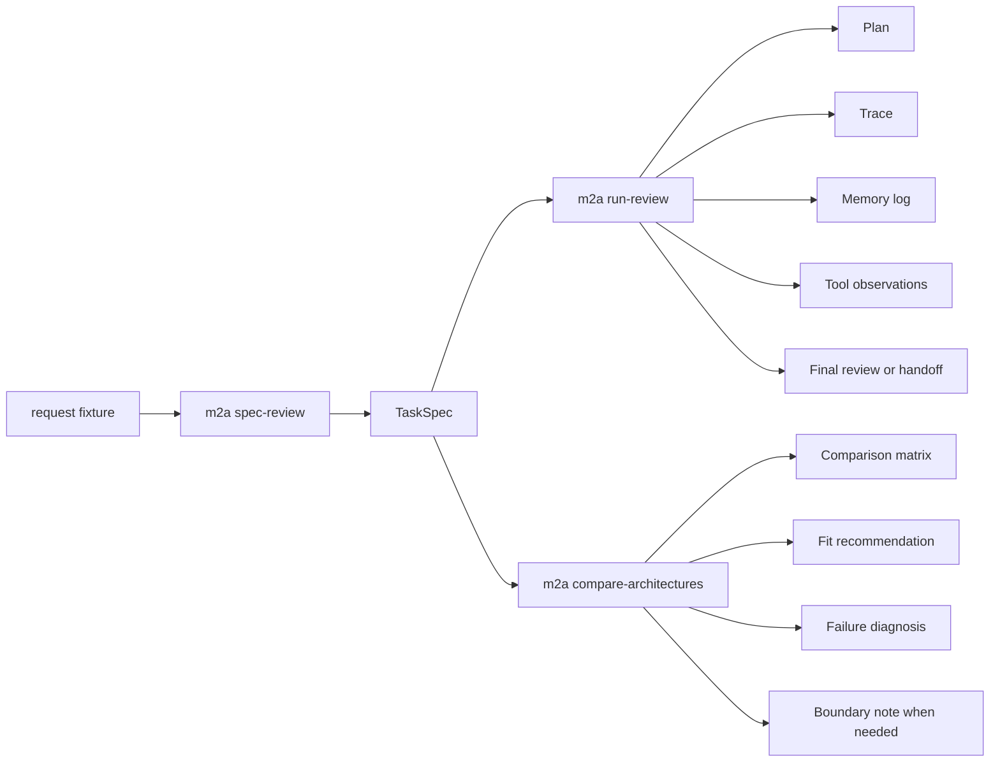

# model-to-agent-checkpoint

`model-to-agent-checkpoint` to jedno skumulowane, offline’owe repozytorium dydaktyczne dla pojedynczego ograniczonego zastosowania: deterministycznego asystenta do przeglądu literatury. Nie chodzi w nim o jakość modelu. Chodzi o biegłość architektoniczną.

Repozytorium konkretyzuje jedno pytanie:

> Jak model generatywny ograniczony kontekstem staje się poprzez architekturę ograniczonym, ukierunkowanym na cel systemem agentowym?

Odpowiada na to pytanie, uruchamiając to samo zadanie przeglądu literatury w pięciu wariantach, nad tym samym lokalnym korpusem, tym samym schematem specyfikacji zadania i tym samym formatem artefaktów:

- `model_only`
- `scripted_pipeline`
- `tool_rich_memoryless`
- `memory_rich_tool_poor`
- `capstone_agent`

Aktywną warstwą końcową jest **AA-S09 — Porównywanie architektur, synteza i granice**. Wcześniejsze warstwy nie są osobnymi projektami. Są ucieleśnione tutaj, w niższych modułach, fixture’ach, testach i artefaktach, z których korzysta warstwa porównawcza.

## Dlaczego repozytorium ma taki kształt

Kod jest celowo mały, ale granice są rzeczywiste:

- cele są strukturami danych, a nie prose promptową,
- kontekst, stan zewnętrzny, pamięć, obserwacje i wyniki skierowane do świata są rozdzielone,
- wywołania narzędzi są przyczynowymi wejściami do dalszych decyzji,
- weryfikacja może zablokować sukces i wymusić przekazanie,
- rekomendacje architektury są oparte na obserwowanych wynikach przebiegów, a nie na sloganach.

Równie celowa jest część przycięta:

- brak żywej sieci i API,
- brak orkiestracji zależnej od frameworka,
- brak baz danych i systemów asynchronicznych,
- brak sterowania RL, wewnętrznych mechanizmów IR, solverów planowania symbolicznego i warstwy wdrożeniowej.

## Jak czytać to repozytorium

Używaj tego schematu etykiet podczas czytania kodu i artefaktów:

- `Nawyk zbliżony do produkcji` oznacza ruch projektowy, który warto przenosić do mocniejszych realnych systemów.
- `Uproszczenie dydaktyczne` oznacza, że repozytorium celowo wybrało mniejszą, ograniczoną wersję szerszego problemu ze świata rzeczywistego.
- `Warto przenieść` oznacza zachowaj zasadę.
- `Nie uogólniaj nadmiernie` oznacza nie traktuj dokładnie tej implementacji jako jedynej poprawnej formy produkcyjnej.

Przykłady:

- `Nawyk zbliżony do produkcji`: jawne specyfikacje zadań, jawna własność stanu, weryfikacja mogąca zablokować sukces oraz porównywanie architektur oparte na obserwowanych przebiegach.
- `Uproszczenie dydaktyczne`: deterministyczna symulacja modelu, syntetyczny lokalny korpus, wyszukiwanie leksykalne oraz doprecyzowanie emitowane jako artefakt zamiast interaktywnej tury z użytkownikiem.

## Szybki start

```bash
poetry install

poetry run m2a spec-review data/requests/clear_bounded_review.txt --out-dir scratch/spec-clear

poetry run m2a run-review scratch/spec-clear/task_spec.json \
  --variant capstone_agent \
  --out-dir scratch/run-capstone

poetry run m2a compare-architectures scratch/spec-clear/task_spec.json \
  --out-dir scratch/compare-clear

poetry run pytest
```

Repozytorium zawiera gotowe do czytania artefakty referencyjne w `examples/`, jeśli chcesz zobaczyć wyniki jeszcze przed uruchamianiem czegokolwiek.

Jeśli nie możesz albo nie chcesz od razu używać `poetry install`, polecenia runtime działają też bezpośrednio na lokalnym drzewie źródeł:

```bash
PYTHONPATH=src python3.13 -m m2a.cli spec-review data/requests/clear_bounded_review.txt --out-dir /tmp/spec-clear
PYTHONPATH=src python3.13 -m m2a.cli run-review data/expected_task_specs/clear_bounded_review.json --variant capstone_agent --out-dir /tmp/run-capstone
PYTHONPATH=src python3.13 -m m2a.cli compare-architectures data/expected_task_specs/clear_bounded_review.json --out-dir /tmp/compare-clear
```

Ta ścieżka awaryjna jest przydatna w środowiskach ograniczonych lub offline, ponieważ sam runtime używa wyłącznie biblioteki standardowej.

## Główne workflow

### 1) Sformalizuj prośbę do specyfikacji zadania

```bash
poetry run m2a spec-review data/requests/clear_bounded_review.txt
```

To polecenie emituje `task_spec.json` i `task_spec.md` z jawnymi celami, ograniczeniami, kryteriami sukcesu, regułami zatrzymania, flagami niejednoznaczności i warunkami przekazania.

Artefakt referencyjny: `examples/spec_review/clear_bounded_review/`

### 2) Uruchom jeden wariant architektury

```bash
poetry run m2a run-review data/expected_task_specs/clear_bounded_review.json \
  --variant capstone_agent
```

To polecenie emituje `plan.json`, `trace.jsonl`, `state_snapshots.jsonl`, `memory_log.jsonl`, `tool_observations.jsonl`, `verification.jsonl`, `stop_decision.json` oraz `final_review.md` albo `handoff_note.md`.

Artefakty referencyjne:

- sukces z kontrolą polityki pamięci: `examples/run_review/capstone_stale_memory_harms/`
- ograniczony wynik doprecyzowania: `examples/run_review/capstone_ambiguous_request/`

### 3) Porównaj architektury na tym samym zadaniu

```bash
poetry run m2a compare-architectures data/expected_task_specs/clear_bounded_review.json
```

To polecenie uruchamia wiele wariantów na tym samym zadaniu i emituje:

- `comparison_matrix.md`
- `fit_recommendation.md`
- `failure_diagnosis.md`
- `boundary_note.md`, gdy to potrzebne

Artefakty referencyjne:

- rekomendacja capstone dla zadania mieszczącego się w zakresie: `examples/compare_architectures/clear_bounded_review/`
- jawna obsługa wyjścia poza zakres: `examples/compare_architectures/boundary_handoff/`

## Mapa pojęciowa



## Układ repozytorium

- `src/m2a/` — kod pakietu
- `data/` — lokalny korpus, fixture’y próśb, oczekiwane specyfikacje zadań, pamięć startowa, mały fixture planistyczny
- `tests/` — testy jednostkowe i regresje end-to-end
- `docs/` — notatki architektoniczne, bridge refresh, dokumenty przekrojowe, zakres kompetencji i granice
- `examples/` — zapisane wyjścia referencyjne dla trzech głównych workflow

`docs/architecture.md` pokazuje konkretny graf modułów i mapę własności stanu.

## Zależności

Runtime wymaga Python 3.11 i biblioteki standardowej. Jedyną zależnością spoza stdlib jest `pytest`, używany wyłącznie po to, by testy scenariuszy i regresji pozostały zwięzłe.

## Co dodaje AA-S09

Wcześniejsze warstwy ustanawiają elementy składowe: ustrukturyzowane cele, stan, pamięć, narzędzia, planowanie, weryfikację oraz zatrzymanie lub przekazanie. AA-S09 dodaje warstwę syntezy:

- uruchomienie wielu wariantów na jednym ograniczonym zadaniu,
- jawne wyjaśnienie kompromisu pamięć-bogata/narzędziowo-uboga vs narzędziowo-bogata/pamięciowo-uboga,
- strukturalną klasyfikację porażek,
- rekomendację architektury opartą na obserwowanych wynikach,
- emitowanie `boundary note` zamiast dryfowania w odroczone tematy.

## Kroki weryfikacyjne

Po `poetry install` te komendy powinny działać bez dostępu do sieci:

```bash
poetry run pytest

poetry run m2a spec-review data/requests/ambiguous_request.txt --out-dir scratch/spec-ambiguous
poetry run m2a run-review scratch/spec-ambiguous/task_spec.json --variant capstone_agent --out-dir scratch/run-ambiguous
poetry run m2a compare-architectures data/expected_task_specs/boundary_handoff.json --out-dir scratch/compare-boundary
```

## Granice

To repozytorium nazywa pola sąsiednie, ale ich nie wchłania. Gdy prośba zależy od sterowania opartego na RL, wnętrzności IR, formalizmów planowania symbolicznego, żywego retrievalu albo operacji produkcyjnych, poprawnym wynikiem jest `boundary note` albo przekazanie, a nie pozornie pewna odpowiedź.

Zobacz `docs/deferred-topics-and-boundaries.md` po jawny kontrakt graniczny.

## Co warto przenosić dalej

- `Warto przenieść`: reprezentuj cele wystarczająco jawnie, by sterowały przepływem, weryfikacją i zatrzymaniem.
- `Warto przenieść`: utrzymuj kontekst, stan zewnętrzny, pamięć, obserwacje i wyniki końcowe na tyle rozdzielone, by można je było osobno inspekować.
- `Warto przenieść`: pozwól, by weryfikacja i diagnoza porażek zmieniały to, co system robi dalej.
- `Warto przenieść`: porównuj architektury na tym samym zadaniu przy wspólnych kształtach artefaktów.
- `Nie uogólniaj nadmiernie`: offline’owy syntetyczny korpus jest narzędziem dydaktycznym, nie tezą, że realne systemy powinny unikać bogatszych warstw danych.
- `Nie uogólniaj nadmiernie`: deterministyczny symulator modelu służy odsłonięciu semantyki sterowania, a nie wiernemu modelowaniu współczesnych LM.
