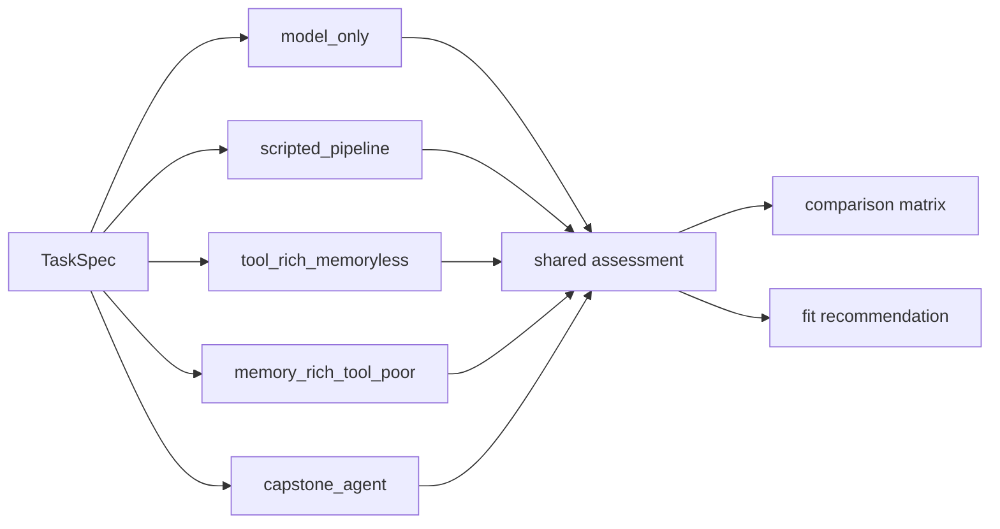

# Warianty architektury

Wszystkie warianty współdzielą ten sam schemat specyfikacji zadania, ten sam korpus, te same kontrakty narzędziowe i ten sam format artefaktów. Nie chodzi o porównywanie różnych aplikacji. Chodzi o porównywanie różnych architektur na tym samym ograniczonym zadaniu.

## Tabela wariantów

| Wariant | Kształt pętli | Narzędzia | Pamięć | Efekt weryfikacji | Typowy wynik |
| --- | --- | --- | --- | --- | --- |
| `model_only` | bezpośrednie generowanie z końcowym sprawdzeniem | brak | brak | może zablokować sukces dopiero na końcu | płynny, ale słabo ugruntowany |
| `scripted_pipeline` | stały, prostoliniowy pipeline | search, read, cite | brak | jedno sprawdzenie; brak gałęzi korekcyjnej | dobry dla prostych, dobrze ukształtowanych zadań |
| `tool_rich_memoryless` | ograniczona pętla | search, read, cite | brak trwałej pamięci | widzi blokery, ale synteza zapomina wcześniejsze dowody | dobre odświeżanie materiału, słabe utrzymywanie informacji |
| `memory_rich_tool_poor` | ograniczona pętla | read, note, cite | trwała pamięć, w tym ryzyko starych notatek | pamięć może pomóc albo zaszkodzić | dobra ciągłość, słabe odzyskiwanie brakujących dowodów |
| `capstone_agent` | ograniczona pętla plan-pamięć-działanie-weryfikacja-zatrzymanie | search, read, note, cite | trwała pamięć z ostrzejszą obsługą nieaktualności | może zmieniać dalsze zachowanie i bezpiecznie się zatrzymać | najlepszy domyślny wybór dla zadań wieloograniczeniowych |

## Dlaczego para kompromisowa jest ważna

Repozytorium stawia jedno kanoniczne pytanie:

> W tym ograniczonym zadaniu przeglądu, co jest lepsze: system bogaty w narzędzia, ale bez pamięci, czy bogaty w pamięć, ale ubogi narzędziowo?

Odpowiedź zależy od tego, co naprawdę ogranicza dane zadanie.

- Jeśli zadanie wymaga świeżej eksploracji, ważne jest wyszukiwanie.
- Jeśli zadanie wymaga wielokrokowej syntezy, ważne jest utrzymywanie informacji.
- Jeśli wymaga obu rzeczy, zwykle wygrywa `capstone_agent`, bo łączy wyszukiwanie z pamięcią powiązaną z dowodami i z ograniczonym zatrzymaniem.

## Gdzie różnice żyją w kodzie

- `model_only` i `scripted_pipeline` znajdują się w `src/m2a/baselines.py`
- para kompromisowa i `capstone_agent` są parametryzowane w `src/m2a/control.py`
- zachowanie pamięci żyje w `src/m2a/memory.py`
- zachowanie narzędzi żyje w `src/m2a/tools.py`
- logika zatrzymania żyje w `src/m2a/feedback.py` i `src/m2a/control.py`

## Przypadki referencyjne

| Przypadek | Co pokazuje |
| --- | --- |
| `examples/compare_architectures/clear_bounded_review/` | rekomendację capstone dla wielotematycznego zadania mieszczącego się w zakresie |
| `data/requests/over_planning_overhead.txt` | że `scripted_pipeline` może być właściwym wyborem przy mniejszym zadaniu |
| `examples/run_review/capstone_stale_memory_harms/` | że ostrzejsza polityka pamięci zapobiega cichemu przejściu nieaktualnych informacji |
| `examples/compare_architectures/boundary_handoff/` | że poprawną odpowiedzią może być `none_in_scope` |

## Przepływ porównywania wariantów

