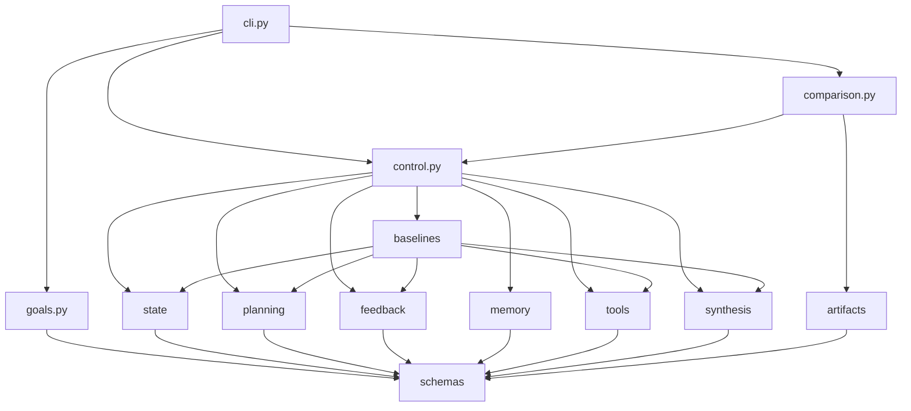

# Architektura

Repozytorium ma jeden pakiet, jeden korzeń CLI, jeden kanoniczny schemat zadania i wiele cienkich wariantów architektury. Warstwa porównawcza jest dobudowana na tych samych współdzielonych prymitywach, a nie stanowi osobnej aplikacji.

## Kształt katalogów

```text
model-to-agent-checkpoint/
├── src/m2a/
│   ├── cli.py
│   ├── goals.py
│   ├── control.py
│   ├── baselines.py
│   ├── comparison.py
│   ├── planning.py
│   ├── feedback.py
│   ├── memory.py
│   ├── tools.py
│   ├── state.py
│   ├── synthesis.py
│   ├── artifacts.py
│   └── schemas.py
├── data/
├── examples/
├── tests/
└── docs/
```

## Kierunek zależności



Intencja jest prosta: lokalne rozumowanie o małych fragmentach.

- CLI parsuje wejście i wybiera ścieżkę usługi.
- usługi (`goals`, `control`, `comparison`) orkiestrują pracę,
- moduły wspierające (`planning`, `feedback`, `memory`, `tools`, `state`, `synthesis`) dostarczają ograniczonego zachowania domenowego,
- `schemas` definiuje stabilne współdzielone kształty,
- `artifacts` jest granicą plików tekstowych.

## Główne odpowiedzialności modułów

| Moduł | Odpowiedzialność | Po co istnieje |
| --- | --- | --- |
| `schemas.py` | Kanoniczne modele danych dla specyfikacji zadań, śladów, zdarzeń pamięci, obserwacji, decyzji zatrzymania i porównań. | Dzięki temu każdy wariant pozostaje porównywalny przy użyciu wspólnego kształtu. |
| `goals.py` | Przepisuje surową prośbę na ograniczony `TaskSpec`. | Czyni cele, ograniczenia, niejednoznaczność i przekazanie jawnymi przed uruchomieniem przebiegu. |
| `state.py` | Zarządza aktywnym kontekstem, stanem zewnętrznym przebiegu, zdarzeniami śladu i migawkami. | Pozwala inspekować kontekst i stan zamiast ukrywać je w środku systemu. |
| `memory.py` | Przechowuje treść pamięci wraz z polityką pobierania i zapominania. | Uczy pamięci jako reprezentacji plus polityki. |
| `tools.py` | Definiuje lokalne narzędzia korpusowe i ich kontrakty. | Czyni semantykę narzędzi i skutki uboczne jawnymi. |
| `planning.py` | Buduje plany, wybiera zestawy dowodów i koduje lekką logikę przeplanowywania. | Utrzymuje planowanie jako coś widocznego i testowalnego. |
| `feedback.py` | Weryfikuje postęp, zamienia blokery na sygnały sterujące i etykietuje porażki strukturalnie. | Zapewnia, że krytyka może zmieniać zachowanie systemu. |
| `synthesis.py` | Składa końcowy przegląd literatury z materiału źródłowego. | Oddziela drafting przeglądu od przepływu sterowania. |
| `baselines.py` | Implementuje `model_only` i `scripted_pipeline`. | Czyni nieagentowe i minimalnie agentowe zachowania jawnymi. |
| `control.py` | Uruchamia konfigurowalną pętlę używaną przez parę kompromisową i `capstone_agent`. | Pokazuje, że zmiany architektury wynikają ze struktury sterowania i polityki. |
| `comparison.py` | Uruchamia porównania wielu wariantów i emituje macierz, rekomendację i artefakty graniczne. | Implementuje AA-S09 bezpośrednio. |
| `artifacts.py` | Czyta i zapisuje artefakty w formie tekstowej. | Utrzymuje I/O wąskie i możliwe do prześledzenia. |
| `cli.py` | Łączy komendy z kodem aplikacyjnym. | Utrzymuje entrypointy cienkie. |

## Własność stanu

To repozytorium traktuje pytanie „gdzie żyje informacja?” jako część programu nauczania.

| Rodzaj stanu | Właściciel | Co zawiera | Gdzie to widać |
| --- | --- | --- | --- |
| Specyfikacja zadania | `TaskSpec` | cele, ograniczenia, budżety, reguły zatrzymania, niejednoznaczność, granice | `task_spec.json`, `task_spec.md` |
| Aktywny kontekst | `RunState.active_context` | bieżące działanie, bieżący fokus, ostatnie referencje do obserwacji, ostatnie referencje do pamięci | `state_snapshots.jsonl` |
| Stan zewnętrzny przebiegu | `RunState.external_state` | wybrane artykuły, przeczytane artykuły, ścieżki do notatek, cytowania, metadane przeglądu | `state_snapshots.jsonl`, `run_summary.json` |
| Pamięć | `MemoryStore` | pamięć startowa, notatki w pamięci, pobrania, zdarzenia zapominania, migawka polityki | `memory_log.jsonl` |
| Obserwacje z narzędzi | `ToolObservation` | wejścia narzędzia, wyjścia, podsumowania, skutki uboczne | `tool_observations.jsonl` |
| Weryfikacja | `VerificationResult` | sprawdzenia, blokery, referencje do dowodów | `verification.jsonl`, `trace.jsonl` |
| Wynik skierowany do świata | `StopDecision` + review lub handoff note | sukces albo ograniczony wynik nie-sukcesu | `stop_decision.json`, `final_review.md`, `handoff_note.md` |

## Dlaczego nie ma tu dodatkowej infrastruktury

Nie ma warstwy async, bazy danych ani wrappera frameworkowego, ponieważ nic z tego nie jest potrzebne, aby nauczyć kluczowego pytania architektonicznego. Dodanie tych elementów uczyłoby głównie wdrożenia i produktów orkiestracyjnych, przez przypadek.

## Co jest bliskie produkcji, a co przycięte dydaktycznie

| Obszar | Nawyk zbliżony do produkcji | Uproszczenie dydaktyczne w repozytorium | Jak to czytać |
| --- | --- | --- | --- |
| obsługa celu | przekształć prośbę w jawny kontrakt zadania przed wykonaniem | kontrakt powstaje z deterministycznego parsowania prośby, a nie z realnego LM lub interaktywnego planera | `Warto przenieść` jawny kontrakt, `nie uogólniaj nadmiernie` mechanizmu parsowania |
| własność stanu | trzymaj aktywny kontekst, trwały stan przebiegu, pamięć, obserwacje i wyniki osobno | stan żyje w prostych strukturach in-memory i artefaktach JSONL | `Warto przenieść` separację, `nie uogólniaj nadmiernie` podłoża przechowywania |
| narzędzia i środowisko | definiuj kontrakty narzędziowe i używaj obserwacji przyczynowo w dalszych decyzjach | środowisko to stały lokalny korpus i cztery deterministyczne narzędzia | `Warto przenieść` granicę kontraktu, `nie uogólniaj nadmiernie` zabawkowego środowiska |
| weryfikacja i zatrzymanie | pozwól, by weryfikacja blokowała sukces i uruchamiała przeplanowanie, doprecyzowanie lub przekazanie | weryfikacja używa małego checkera regułowego zamiast bogatszych ewaluatorów albo ludzi | `Warto przenieść` semantykę sterowania, `nie uogólniaj nadmiernie` implementacji checkera |
| porównywanie architektur | porównuj warianty na jednym współdzielonym zadaniu i przy wspólnych kształtach artefaktów | porównanie pozostaje w jednym ograniczonym offline’owym obszarze | `Warto przenieść` uczciwą metodę porównania, `nie uogólniaj nadmiernie` zakresu domeny |
| infrastruktura | utrzymuj granice jawne i możliwe do prześledzenia | repozytorium pomija async orchestration, usługi, kolejki, bazy danych i wdrożenie | `Warto przenieść` przejrzystość granic, `nie uogólniaj nadmiernie` braku infrastruktury |

## Praktyczna kolejność czytania

Dla większości osób najkrótsza poprawna ścieżka to:

1. `README.md`
2. `docs/bridge-refresh.md`
3. `src/m2a/goals.py`
4. `src/m2a/control.py`
5. `src/m2a/comparison.py`
6. jeden zapisany przykład z `examples/compare_architectures/clear_bounded_review/`
7. dokumenty przekrojowe w kolejności od `AA-S01` do `AA-S09`
