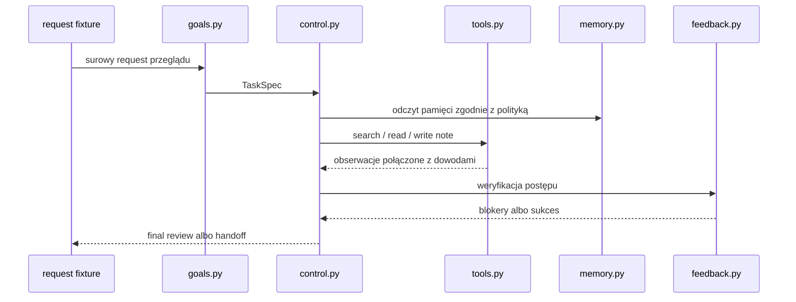

# Szybkie odświeżenie: AA-S03 do AA-S08 na jednym przypadku

AA-S09 jest warstwą syntezy. Zakłada, że uczący się widzi już niższe elementy.
Ten dokument daje najkrótszą ścieżkę odświeżenia od AA-S03 do AA-S08 na jednym kanonicznym requestcie:

`data/requests/clear_bounded_review.txt`

Celem nie jest ponowne uczenie każdego slice.
Celem jest odbudowanie roboczego modelu mentalnego potrzebnego do porównania architektur.

## Ścieżka odświeżenia

### 1. Zbuduj z requestu obiekt zadania

Uruchom:

```bash
poetry run m2a spec-review data/requests/clear_bounded_review.txt --out-dir scratch/bridge-spec
```

Spójrz na:

- `scratch/bridge-spec/task_spec.json`
- `examples/spec_review/clear_bounded_review/task_spec.json`

Na co zwrócić uwagę:

- cele są jawne i listowane,
- warunki `stop` i `handoff` są elementami pierwszej klasy,
- request zostaje ograniczony jeszcze przed wywołaniem narzędzi.

### 2. Zobacz rozdzielenie `context` i `state`

Otwórz trace wariantu capstone z przykładu porównania:

- `examples/compare_architectures/clear_bounded_review/variants/capstone_agent/trace.jsonl`
- `examples/compare_architectures/clear_bounded_review/variants/capstone_agent/state_snapshots.jsonl`

Na co zwrócić uwagę:

- `trace` pokazuje, co się wydarzyło,
- `state_snapshots` pokazuje, gdzie informacja teraz żyje,
- aktywny kontekst nie jest tym samym co zewnętrzny stan przebiegu.

### 3. Wróć do pamięci jako polityki, nie tylko magazynu

Otwórz:

- `examples/compare_architectures/clear_bounded_review/variants/capstone_agent/memory_log.jsonl`
- `examples/run_review/capstone_stale_memory_harms/memory_log.jsonl`

Na co zwrócić uwagę:

- pierwszy event pamięci jest snapshotem polityki,
- zapisy i odczyty są logowane osobno,
- stara pamięć może być blokerem, a nie tylko tłem.

### 4. Wróć do narzędzi jako kontraktów

Otwórz:

- `src/m2a/tools.py`
- `examples/compare_architectures/clear_bounded_review/variants/capstone_agent/tool_observations.jsonl`

Na co zwrócić uwagę:

- każde narzędzie ma warunki wejściowe, wyjścia i skutki uboczne,
- `search` i `read` nie są wymienne,
- składanie cytowań jest działaniem, a nie końcowym formatowaniem stringa.

### 5. Wróć do planowania i weryfikacji

Otwórz:

- `src/m2a/planning.py`
- `src/m2a/feedback.py`
- `data/planning/greedy_trap.json`
- `tests/test_planning.py`

Na co zwrócić uwagę:

- planowanie jest polityką wyboru, a nie „mistyczną inteligencją”,
- weryfikacja jawnie oznacza brakujące pokrycie,
- replanning uruchamiają blokery, a nie ogólne „myślenie mocniej”.

### 6. Wróć do `stop`, `clarification` i `handoff`

Otwórz:

- `examples/run_review/capstone_ambiguous_request/handoff_note.md`
- `examples/compare_architectures/boundary_handoff/boundary_note.md`
- `src/m2a/control.py`

Na co zwrócić uwagę:

- ograniczone wyniki niebędące sukcesem są częścią poprawności,
- niejednoznaczność i drift poza zakresem są obsługiwane jawnie,
- przebieg nie ogłasza zwykłego sukcesu, jeśli blokery nadal istnieją.

## Diagram odświeżenia



## Dlaczego to odświeżenie jest ważne dla AA-S09

AA-S09 nie polega na pamięci definicji.
Polega na zdolności porównywania architektur na podstawie widocznych skutków w artefaktach.
To odświeżenie przywraca właśnie tę warstwę widzenia systemu.
