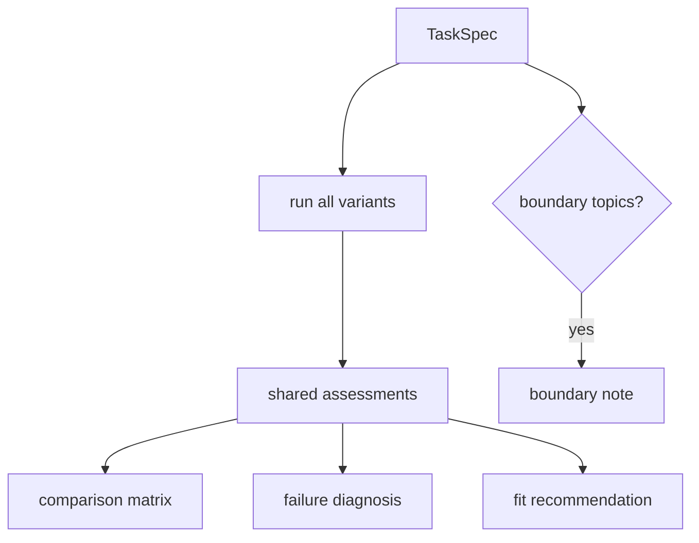

# Przewodnik po syntezie końcowej

AA-S09 zamienia wcześniejsze warstwy w jeden workflow prowadzący do obronionej rekomendacji architektury.

## Co zmienia się na warstwie capstone

Wcześniejsze warstwy uczą elementów składowych. Warstwa końcowa stawia mocniejsze pytanie:

> Dla konkretnego ograniczonego zadania, która architektura naprawdę pasuje i gdzie przebiegają granice?

W tym repozytorium realizuje to `src/m2a/comparison.py`, zbudowany na tych samych współdzielonych schematach, narzędziach, logice pamięci, pomocnikach planowania i regułach informacji zwrotnej, których używają przebiegi pojedynczych wariantów.

## Workflow capstone

1. sformalizuj prośbę przez `m2a spec-review`,
2. uruchom wiele wariantów przez `m2a compare-architectures`,
3. obejrzyj ślady dla poszczególnych wariantów,
4. przeczytaj macierz, diagnozę porażek i rekomendację dopasowania,
5. sprawdź, czy potrzebna jest nota graniczna.

## Co tutaj znaczy „dopasowanie”

Rekomendacja nie jest ogólnym rankingiem architektur. Jest ograniczona zadaniem.

W tym repozytorium dopasowanie ocenia się przez obserwowane wyniki, takie jak:

- udane zakończenie vs ograniczone przekazanie,
- użyte cytowania,
- liczba przeczytanych artykułów,
- zdarzenia pamięci,
- rzeczywisty profil użycia narzędzi,
- blokujące problemy, które pozostały przy zatrzymaniu.

Dzięki temu rekomendacja pozostaje oparta na materiale źródłowym.

## Przypadek jasny

Dla `clear_bounded_review` repozytorium rekomenduje `capstone_agent`.

Dlaczego:

- odnosi sukces,
- używa zarówno wyszukiwania, jak i pamięci opartej na notatkach,
- zachowuje ten sam ograniczony format artefaktów co prostsze warianty,
- jest lepszym wyborem domyślnym dla wielotematycznego, porównawczego przeglądu niż każda z dwóch skrajności kompromisu.

## Kontrprzykład małego zadania

Dla `over_planning_overhead` repozytorium rekomenduje `scripted_pipeline`.

Ten przypadek jest celowo mały. Uczy przeciwieństwa hasła „agenty są zawsze lepsze”: czasem mniejsza architektura jest właściwym wyborem.

## Kontrprzykład poza zakresem

Dla `boundary_handoff` repozytorium rekomenduje `none_in_scope`.

To prowadzi do ostatniej lekcji capstone: porównywanie architektur również pozostaje ograniczone zakresem domeny.

## Diagram capstone

