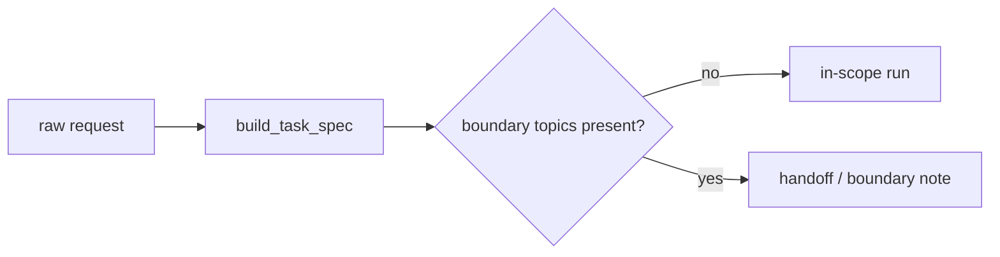

# Tematy odroczone i granice zakresu

To repozytorium jest celowo architektoniczne i kompozycyjne. Nie wchłania po cichu specjalizacji sąsiednich.

## Tematy jawnie odroczone

- sterowanie oparte na RL albo uczenie polityki,
- wnętrzności IR, takie jak ranking lub projekt indeksu,
- formalne języki planowania symbolicznego albo solvery,
- żywy retrieval z sieci i zewnętrzne API,
- produkty orkiestracyjne zależne od frameworka,
- wdrożenie, obserwowalność, governance i operacje produkcyjne,
- grounding multimodalny,
- ciężka metodologia benchmarkowa.

## Dlaczego są odroczone

To ważne tematy, ale nie są konieczne do zrozumienia, jak ograniczony model staje się systemem agentowym poprzez stan, pamięć, planowanie, narzędzia, weryfikację i logikę zatrzymania/przekazania.

Dodanie ich tutaj zniekształciłoby dydaktyczny cel repozytorium.

## Jak granica jest egzekwowana

`src/m2a/goals.py` wykrywa jawne tematy graniczne podczas formalizowania zadania.

Jeśli prośba zależy od tematów odroczonych, system **nie**:

- udaje ugruntowanego przeglądu,
- nie udaje, że lokalny korpus pokrywa brakujący zakres,
- nie rozszerza po cichu architektury.

Zamiast tego emituje:

- `handoff_note.md` z `run-review`, albo
- `boundary_note.md` z `compare-architectures`.

## Przykład

Zobacz:

- `data/requests/boundary_handoff.txt`
- `examples/compare_architectures/boundary_handoff/boundary_note.md`

Ten przykład prosi o benchmarki żywego retrievalu, wnętrzności rankingu wektorowego i architekturę wdrożenia produkcyjnego. Poprawnym wynikiem jest nota graniczna, a nie spekulacyjna odpowiedź.

## Przepływ graniczny

## Czego repozytorium mimo to uczy

Nawet kiedy zatrzymuje się na granicy, wciąż uczy czegoś ważnego: ograniczone systemy potrzebują jawnych nie-celów.

To jest element jakości architektury, a nie brak.
