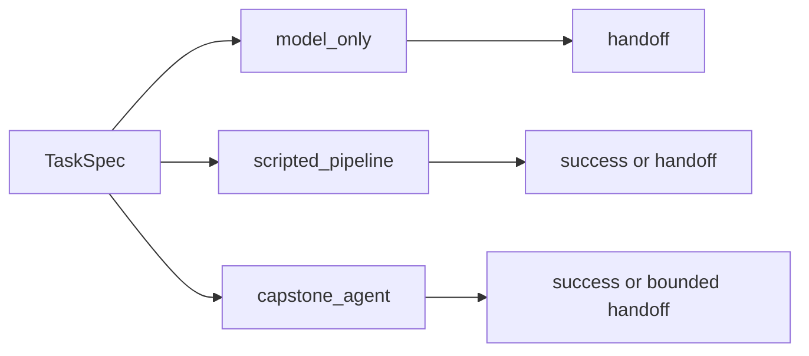

# AA-S01 — Od modelu do agenta

## Cel warstwy

Uwidocznić różnicę między bezpośrednim generowaniem, stałym skryptowaniem i ograniczonymi pętlami agentowymi na tym samym zadaniu przeglądu literatury.

## Dlaczego ta warstwa ma znaczenie

Bez tej warstwy późniejsza rozmowa o architekturze agentowej rozpada się na gry nazewnicze. Uczący się musi zobaczyć, że agentowość jest strukturą sterowania, a nie tylko dostępem do narzędzi albo długością promptu.

## Wymagania wstępne

Ogólny przegląd repozytorium i przykład przewodni z przeglądem literatury.

## Przypadek przewodni

Uruchom `model_only`, `scripted_pipeline` i `capstone_agent` na `clear_bounded_review`, a następnie porównaj ich ślady i decyzje zatrzymania.

## Zakotwiczenie w kodzie

- `src/m2a/baselines.py::run_model_only`
- `src/m2a/baselines.py::run_scripted_pipeline`
- `src/m2a/control.py::run_variant`

## Zakotwiczenie w workflow

`poetry run m2a compare-architectures data/expected_task_specs/clear_bounded_review.json`

## Zakotwiczenie w artefaktach

`examples/compare_architectures/clear_bounded_review/`

## Diagram

## Ujawniane błędne przekonanie lub tryb awarii

„Agent to po prostu chatbot z lepszym promptem.” Zapisane porównanie pokazuje różne ścieżki sterowania, a nie tylko inne sformułowania.

## Noty odroczone / granice

Ta warstwa nadal pozostaje offline i deterministyczna. Nie mówi nic o wdrożeniu ani integracji z dostawcami.
