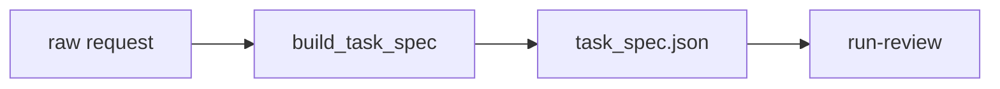

# AA-S02 — Cele, specyfikacja zadania i kryteria sukcesu

## Cel warstwy

Przekształcić surowe prośby o przegląd w jawne kontrakty zadania, zanim zacznie się jakikolwiek przebieg.

## Dlaczego ta warstwa ma znaczenie

Cele mają znaczenie tylko wtedy, gdy kształtują przepływ sterowania, ewaluację i zatrzymanie. Ukryta proza promptowa uczyniłaby późniejsze porównania bez znaczenia.

## Wymagania wstępne

AA-S01.

## Przypadek przewodni

Użyj `spec-review` na `clear_bounded_review.txt` i `ambiguous_request.txt`, aby zobaczyć zarówno jasną specyfikację, jak i specyfikację gotową do doprecyzowania.

## Zakotwiczenie w kodzie

- `src/m2a/goals.py::build_task_spec`
- `src/m2a/artifacts.py::emit_task_spec`

## Zakotwiczenie w workflow

`poetry run m2a spec-review data/requests/ambiguous_request.txt --out-dir scratch/spec-ambiguous`

## Zakotwiczenie w artefaktach

`examples/spec_review/clear_bounded_review/task_spec.json` oraz `examples/run_review/capstone_ambiguous_request/handoff_note.md`

## Diagram

## Ujawniane błędne przekonanie lub tryb awarii

„Prośba jest już specyfikacją celu.” Fixture z niejednoznacznością pokazuje, dlaczego to nieprawda.

## Noty odroczone / granice

Repozytorium nie implementuje interaktywnych pętli doprecyzowania w czacie; doprecyzowanie jest reprezentowane jako artefakt.
