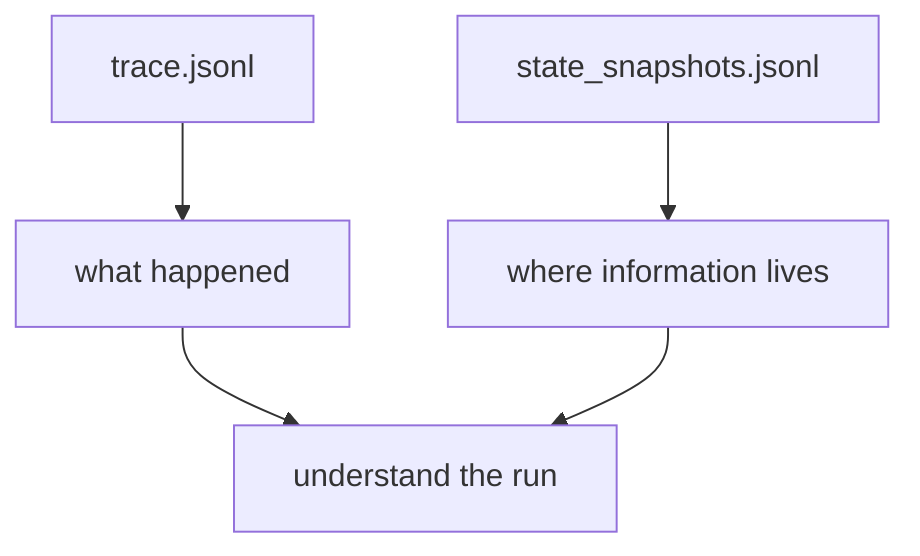

# AA-S03 — Pętle sterowania, stan i kontekst

## Cel warstwy

Pokazać, gdzie żyje informacja podczas wielokrokowego przebiegu.

## Dlaczego ta warstwa ma znaczenie

Uczący się potrzebują czegoś więcej niż narracji kroków. Potrzebują mapy własności stanu.

## Wymagania wstępne

AA-S01 i AA-S02.

## Przypadek przewodni

Czytaj ślad capstone i migawki stanu dla `clear_bounded_review` obok siebie.

## Zakotwiczenie w kodzie

- `src/m2a/state.py::RunState`
- `src/m2a/control.py::_run_profile`

## Zakotwiczenie w workflow

`poetry run m2a run-review data/expected_task_specs/clear_bounded_review.json --variant capstone_agent`

## Zakotwiczenie w artefaktach

`examples/compare_architectures/clear_bounded_review/variants/capstone_agent/trace.jsonl` oraz `state_snapshots.jsonl`

## Diagram

## Ujawniane błędne przekonanie lub tryb awarii

„Długi ślad wystarcza.” Migawki stanu pokazują to, czego sam ślad nie pokazuje: aktywny kontekst vs stan zewnętrzny.

## Noty odroczone / granice

Nie ma tu rozproszonego stanu ani historii przebiegów opartej na bazie danych. Chodzi o przejrzystość pojęciową.
