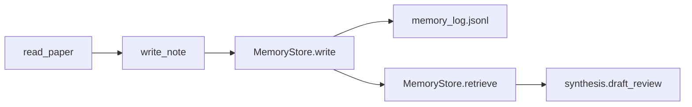

# AA-S04 — Architektury pamięci i polityki trwałości

## Cel warstwy

Uczyć pamięci jako treści plus polityki, a nie jako ogólnego pojemnika do przechowywania.

## Dlaczego ta warstwa ma znaczenie

Warstwa końcowa wprost porównuje systemy bogate w pamięć i systemy bez pamięci, więc polityka pamięci musi być konkretna.

## Wymagania wstępne

AA-S03.

## Przypadek przewodni

Porównaj `memory_rich_tool_poor` z `capstone_agent` na `stale_memory_harms`.

## Zakotwiczenie w kodzie

- `src/m2a/memory.py::MemoryStore`
- `src/m2a/memory.py::MemoryPolicy`
- `src/m2a/control.py::_memory_policy_for`

## Zakotwiczenie w workflow

`poetry run m2a run-review data/requests/stale_memory_harms.txt --variant capstone_agent`

## Zakotwiczenie w artefaktach

`examples/run_review/capstone_stale_memory_harms/memory_log.jsonl`

## Diagram

## Ujawniane błędne przekonanie lub tryb awarii

„Więcej pamięci jest zawsze lepsze.” Przypadek starej pamięci pokazuje, dlaczego polityka ma znaczenie.

## Noty odroczone / granice

Nie ma tu wyuczonego retrievalu pamięci ani warstwy modelowania użytkownika.
