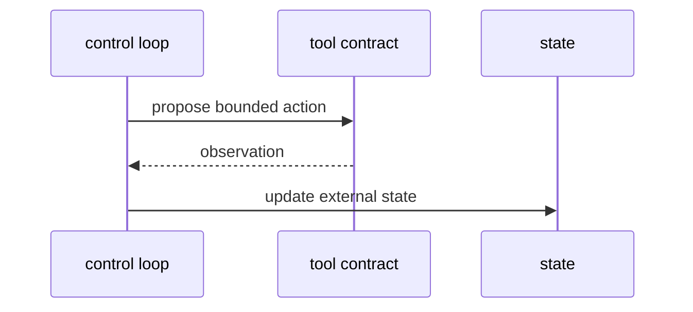

# AA-S05 — Wybór działania, narzędzia i interfejsy do środowiska

## Cel warstwy

Uczynić użycie narzędzi konkretnym jako zbiór ograniczonych działań z jawnymi kontraktami.

## Dlaczego ta warstwa ma znaczenie

Użycie narzędzi ma znaczenie tylko wtedy, gdy semantyka interfejsu jest widoczna, a dalsze zachowanie rzeczywiście zależy od obserwacji.

## Wymagania wstępne

AA-S02 do AA-S04.

## Przypadek przewodni

Obejrzyj przebieg capstone i prześledź, jak `search_corpus`, `read_paper`, `write_note` i `assemble_citations` zmieniają stan.

## Zakotwiczenie w kodzie

- `src/m2a/tools.py::ToolBox`
- `src/m2a/control.py::_propose_next_action`
- `src/m2a/control.py::_run_profile`

## Zakotwiczenie w workflow

`poetry run m2a run-review data/expected_task_specs/clear_bounded_review.json --variant capstone_agent`

## Zakotwiczenie w artefaktach

`examples/compare_architectures/clear_bounded_review/variants/capstone_agent/tool_observations.jsonl`

## Diagram

## Ujawniane błędne przekonanie lub tryb awarii

„Każde wywołanie narzędzia czyni system agentowym.” `scripted_pipeline` też używa narzędzi, ale bez tej samej semantyki sterowania.

## Noty odroczone / granice

Nie ma tu żywej integracji z systemami zewnętrznymi ani mutowalnego środowiska poza plikami z notatkami.
