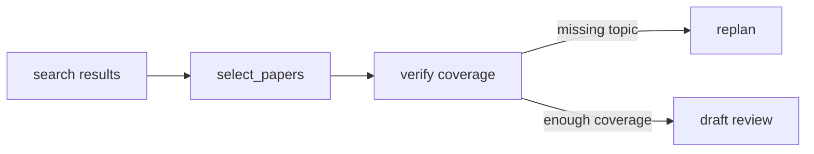

# AA-S06 — Planowanie, dekompozycja i intuicja wyszukiwania

## Cel warstwy

Pokazać planowanie jako selektywny wybór sterujący, który kształtuje zbieranie materiału źródłowego.

## Dlaczego ta warstwa ma znaczenie

Planowanie jest jednym z głównych sposobów, w jakie generator staje się ograniczonym agentem, ale repozytorium utrzymuje je małe i możliwe do prześledzenia.

## Wymagania wstępne

AA-S03 do AA-S05.

## Przypadek przewodni

Przeczytaj `data/planning/greedy_trap.json` i odpowiadające mu testy, a następnie porównaj to z tym, jak serializowany jest plan capstone.

## Zakotwiczenie w kodzie

- `src/m2a/planning.py::build_initial_plan`
- `src/m2a/planning.py::select_papers`
- `src/m2a/planning.py::replan`

## Zakotwiczenie w workflow

`poetry run m2a compare-architectures data/expected_task_specs/clear_bounded_review.json`

## Zakotwiczenie w artefaktach

`data/planning/greedy_trap.json`, `tests/test_planning.py` oraz emitowane pliki `plan.json`

## Diagram

## Ujawniane błędne przekonanie lub tryb awarii

„Planowanie jest zawsze lepsze.” Fixture małego zadania może nadal faworyzować `scripted_pipeline`.

## Noty odroczone / granice

Formalne planery symboliczne są celowo poza zakresem.
