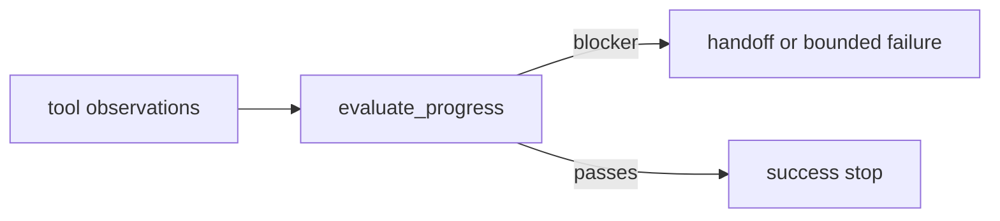

# AA-S07 — Grounding, informacja zwrotna, refleksja i analiza błędów strukturalnych

## Cel warstwy

Powiązać refleksję z materiałem źródłowym i jawnymi sygnałami porażki.

## Dlaczego ta warstwa ma znaczenie

Bez tej warstwy refleksja staje się pustą samokrytyką. Reguła repozytorium jest ostrzejsza: informacja zwrotna musi móc zmienić zachowanie albo zablokować sukces.

## Wymagania wstępne

AA-S03 do AA-S06.

## Przypadek przewodni

Porównaj udany przebieg capstone z przypadkiem stale-memory z porażką wariantu `memory_rich_tool_poor` na tym samym żądaniu.

## Zakotwiczenie w kodzie

- `src/m2a/feedback.py::evaluate_progress`
- `src/m2a/feedback.py::reflection_actions`
- `src/m2a/control.py::_finalize_result`

## Zakotwiczenie w workflow

`poetry run m2a run-review data/requests/stale_memory_harms.txt --variant memory_rich_tool_poor`

## Zakotwiczenie w artefaktach

`examples/run_review/capstone_stale_memory_harms/verification.jsonl` oraz odpowiadająca mu diagnoza w porównaniu

## Diagram

## Ujawniane błędne przekonanie lub tryb awarii

„Refleksja automatycznie poprawia poprawność.” Kod wymaga blokerów, zanim zostanie wyemitowane działanie refleksyjne.

## Noty odroczone / granice

Repozytorium nie implementuje wyuczonych modeli krytyki ani ciężkich ewaluatorów benchmarkowych.
