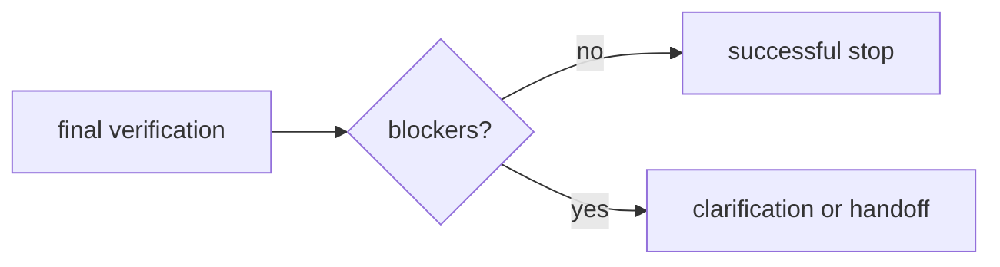

# AA-S08 — Zatrzymanie, przekazanie i ograniczona autonomia

## Cel warstwy

Traktować poprawne wyniki niebędące sukcesem jako zachowanie pierwszej klasy.

## Dlaczego ta warstwa ma znaczenie

Ograniczony system nie jest kompletny, dopóki nie wie, kiedy nie powinien kontynuować.

## Wymagania wstępne

AA-S02 do AA-S07.

## Przypadek przewodni

Uruchom `capstone_agent` na `ambiguous_request.txt` i `boundary_handoff.txt`.

## Zakotwiczenie w kodzie

- `src/m2a/control.py::_make_handoff`
- `src/m2a/control.py::_stop_decision`
- `src/m2a/feedback.py::evaluate_progress`

## Zakotwiczenie w workflow

`poetry run m2a run-review data/requests/ambiguous_request.txt --variant capstone_agent`

## Zakotwiczenie w artefaktach

`examples/run_review/capstone_ambiguous_request/handoff_note.md` oraz `examples/compare_architectures/boundary_handoff/boundary_note.md`

## Diagram

## Ujawniane błędne przekonanie lub tryb awarii

„Zatrzymanie i przekazanie to sprawy tylko produkcyjne.” Repozytorium traktuje je jako warunki poprawności.

## Noty odroczone / granice

Nie ma tu kolejki przeglądu ludzkiego ani warstwy ticketowej; ograniczonym wynikiem jest artefakt tekstowy.
