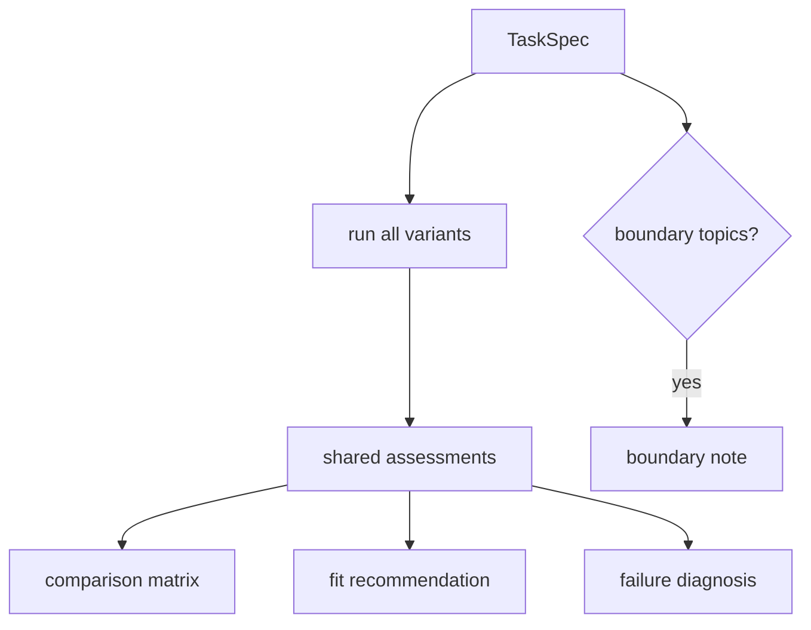

# AA-S09 — Porównywanie architektur i granice zastosowania

## Cel warstwy

Porównać wiele wariantów na jednym ograniczonym zadaniu, zdiagnozować ich porażki strukturalnie i zarekomendować jedną architekturę albo wynik graniczny.

## Dlaczego ta warstwa ma znaczenie

To warstwa końcowa. Zamienia wcześniejsze elementy w obroniony osąd architektoniczny zamiast w zbiór części.

## Wymagania wstępne

AA-S01 do AA-S08.

## Przypadek przewodni

Uruchom `compare-architectures` na `clear_bounded_review` i `boundary_handoff`.

## Zakotwiczenie w kodzie

- `src/m2a/comparison.py::compare_architectures`
- `src/m2a/comparison.py::_assess`
- `src/m2a/comparison.py::_render_recommendation`

## Zakotwiczenie w workflow

`poetry run m2a compare-architectures data/expected_task_specs/clear_bounded_review.json --out-dir scratch/compare-clear`

## Zakotwiczenie w artefaktach

`examples/compare_architectures/clear_bounded_review/` oraz `examples/compare_architectures/boundary_handoff/`

## Diagram

## Ujawniane błędne przekonanie lub tryb awarii

„Jedna architektura jest najlepsza zawsze.” Repozytorium rekomenduje różne warianty dla różnych ograniczonych zadań i może także zarekomendować `none_in_scope`.

## Co warto przenosić, a co jest przycięte

- `Warto przenieść`: porównuj architektury na tym samym zadaniu, przy tej samej specyfikacji i tym samym kształcie artefaktów, zanim sformułujesz rekomendację.
- `Warto przenieść`: pozwól, by obserwowane wyniki przebiegów ważyły więcej niż slogany architektoniczne.
- `Warto przenieść`: traktuj noty graniczne i ograniczone wyniki niebędące sukcesem jako poprawne rezultaty architektoniczne.
- `Nie uogólniaj nadmiernie`: dokładne sygnały scoringowe i ograniczone zadanie przeglądu literatury są rusztowaniem dydaktycznym, a nie uniwersalną formułą wyboru architektury.

## Noty odroczone / granice

Repozytorium kończy się na syntezie architektonicznej i kompozycyjnej. Nie przechodzi do operacji produkcyjnych ani specjalistycznych poddziedzin.
